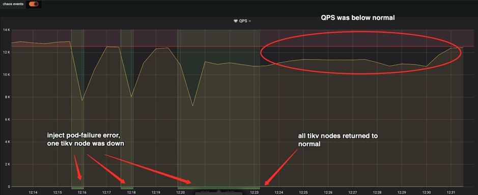
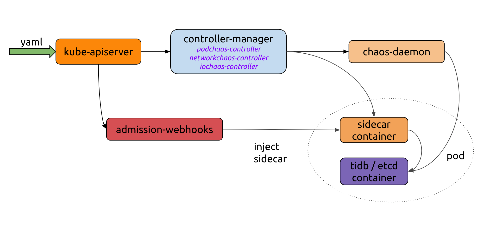
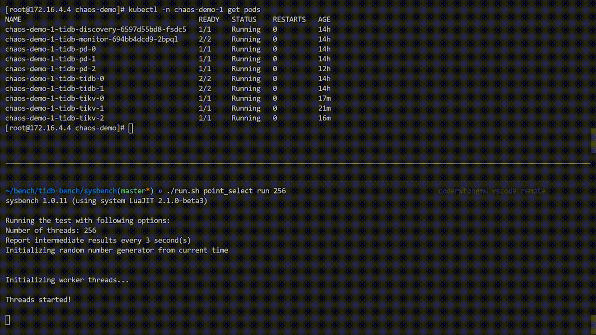

2019 年 12 月 31 日，我们在 GitHub 上正式开源了 Chaos Mesh。作为一个云原生的混沌测试平台，Chaos Mesh 提供在 Kubernetes 平台上进行混沌测试的能力。本篇文章将围绕 Chaos Mesh 起源及原理等方面进行介绍，并结合具体案例带领大家一起探索混沌测试的世界。


现实世界中，各类故障可能会随时随地的发生，其中有很多故障我们无法避免，例如磁盘突然写坏，或者机房突然断网断电等等。这些故障可能会给公司造成巨大损失，因此提升系统对于故障的容忍度成为很多工程师努力的目标。

为了更方便地验证系统对于各种故障的容忍能力，Netflix 创造了一只名为 Chaos 的猴子，并且将它放到 AWS 云上，用于向基础设施以及业务系统中注入各类故障类型。这只 “猴子” 就是混沌工程起源。

在 PingCAP 我们也面临同样的问题，所以在很早的时候就开始探索混沌工程，并逐渐在公司内部实践落地。

在最初的实践中我们为 TiDB 定制了一套自动化测试平台，在平台中我们可以自己定义测试场景，并支持模拟各类错误情况。但是由于 TiDB 生态的不断成熟，各类周边工具 [TiDB Binlog](https://github.com/pingcap/tidb-binlog)、[TiDB Data Migration](https://github.com/pingcap/dm)、[TiDB Lightning](https://github.com/pingcap/tidb-lightning) 等的出现，测试需求也越来越多，逐渐出现了各个组件的的测试框架。但是混沌实验的需求是共有的，通用化的混沌工具就变的尤为重要。最终我们将混沌相关实现从自动化测试平台中抽离出来，成为了 Chaos Mesh 的最初原型，并经过重新设计和完善，最终于 [Github](https://github.com/pingcap/chaos-mesh) 上开源，项目地址: [https://github.com/pingcap/chaos-mesh](https://github.com/pingcap/chaos-mesh)。 

## Chaos Mesh 能做些什么？


<div class="caption-center"> 使用 Chaos Mesh 注入 TiKV 节点宕机后发现 QPS 恢复时间异常问题</div>

这里以使用 Chaos Mesh 模拟在 TiKV 宕机的场景下观测业务 QPS 变化的实验为例。TiKV 是 TiDB 的分布式存储引擎。根据我们预期，大多数情况下 TiKV 节点宕机时， QPS 可能会出现瞬时的抖动，但是当 TiKV 节点恢复后 QPS 可以在很短的时候恢复到故障发生前的水位。从监控曲线上可以看出，前两次在 TiKV 节点恢复后，QPS 能够在短时间回到正常，但在最后一次实验中，在 TiKV 节点恢复后，业务的 QPS 并未在短时间内恢复到正常状态，这和预期不符。最后经过定位确认，当前版本（V3.0.1）的 TiDB 集群在处理 TiKV 宕机的情况下，的确存在问题，并且已经在新的版本里面修复，对应的 PR: [tidb/11391](https://github.com/pingcap/tidb/pull/11391), [tidb/11344](https://github.com/pingcap/tidb/pull/11344)。

上面描述的场景只是我们平时混沌实验中的一类，Chaos Mesh 还支持许多其他的错误注入：

*   pod-kill：模拟 Kubernetes Pod 被 kill。

*   pod-failure：模拟 Kubernetes Pod 持续不可用，可以用来模拟节点宕机不可用场景。

*   network-delay：模拟网络延迟。

*   network-loss：模拟网络丢包。

*   network-duplication: 模拟网络包重复。

*   network-corrupt: 模拟网络包损坏。

*   network-partition：模拟网络分区。

*   I/O delay : 模拟文件系统 I/O 延迟。

*   I/O errno：模拟文件系统 I/O 错误 。

## 背后的思考 

从上面的介绍我们了解到，Chaos Mesh 的目标是要做一个通用的混沌测试工具，所以最开始我们就定下了几个原则。

### 易用性

*   无特殊依赖，可以在 Kubernetes 集群上面直接部署，包括 [Minikube](https://github.com/kubernetes/minikube)。

*   无需修改应用的部署逻辑，理想的情况是可以在生产环境上进行混沌实验 。

*   易于编排实验的错误注入行为，易于查看实验的状态和结果，并能够快速地对注入的故障进行回滚。

*   隐藏底层的实现细节，用户更聚焦于编排自己需要的实验。

### 拓展性

*   基于现有实现，易于扩展新的故障注入种类。

*   方便集成到其他测试框架中。

作为一个通用的工具，易用性是必不可少的，一个工具不管功能如何多，如何强大，如果不够易用，那么这个工具最终也会失去用户，也就失去了工具的本身的价值。

另一方面在保证易用的前提下，拓展性也是必不可少。如今的分布式系统越来越复杂，各种新的问题层出不穷，Chaos Mesh 的目标的是当有新的需求的时候，我们可以方便去在 Chaos Mesh 中实现，而不是重新再造个轮子。

## 来点硬核的  

### 为什么是 Kubernetes？

在容器圈，Kubernetes 可以说是绝对的主角，其增长速度远超大家预期，毫无争议地赢得了容器化管理和协调的战争。换一句话说目前 Kubernetes 更像是云上的操作系统。

TiDB 作为一个真 Cloud-Native 分布式开源数据库产品，一开始我们内部的自动化测试平台就是在 Kubernetes 上构建的，在 Kubernetes 上每天运行着数十上百的 TiDB 集群，进行着各类实验，有功能性测试，有性能测试，更有很大一部分是各种混沌测试，模拟各种现实中可能出现的情况。为了支持这些混沌实验，Chaos 和 Kubernetes 结合就成为了必然。 


### CRD 的设计 

Chaos Mesh 中使用 [CRD](https://kubernetes.io/docs/tasks/access-kubernetes-api/custom-resources/custom-resource-definitions/) 来定义 chaos 对象，在 Kubernetes 生态中 CRD 是用来实现自定义资源的成熟方案，又有非常成熟的实现案例和工具集供我们使用，这样我们就可以借助于生态的力量，避免重复造轮子。并且可以更好的融合到 Kubernetes 生态中。

最初的想法是把所有的错误注入类型定义到统一的 CRD 对象中，但在实际设计的时候发现，这样的设计行不通，因为不同的错误注入类型差别太大，你没办法预料到后面可能会增加什么类型的错误注入，很难能有一个结构去很好的覆盖到所有场景。又或者最后这个结构变得异常复杂和庞大，很容易引入潜在的 bug。

所以在 Chaos Mesh 中 CRD 的定义可以自由发挥，根据不同的错误注入类型，定义单独的 CRD 对象。如果新添加的错误注入符合已有的 CRD 对象定义，就可以拓展这个 CRD 对象；如果是一个完全不同的错误注入类型，也可以自己重新增加一个 CRD 对象，这样的设计可以将不同的错误注入类型的定义以及逻辑实现从最顶层就抽离开，让代码结构看起来更加清晰，并且降低了耦合度，降低出错的几率。另一方面 [controller-runtime](https://github.com/kubernetes-sigs/controller-runtime) 提供了很好的 controller 实现的封装，不用去对每一个 CRD 对象去自己实现一套 controller 的逻辑，避免了大量的重复劳动。

目前在 Chaos Mesh 中设计了三个 CRD 对象，分别是 PodChaos、NetworkChaos 以及 IOChaos，从命名上就可以很容易的区分这几个 CRD 对象分别对应的错误注入类型。 

以 PodChaos 为例： 

```
spec:
 action: pod-kill
 mode: one
 selector:
   namespaces:
     - tidb-cluster-demo
   labelSelectors:
     "app.kubernetes.io/component": "tikv"
 scheduler:
   cron: "@every 2m"
```

PodChaos 对象用来实现注入 Pod 自身相关的错误，action 定义了具体错误，比如 pod-kill 定义了随机 kill pod 的行为，在 Kubernetes 中 Pod 宕掉是非常常见的问题，很多原生的资源对象会自动处理这种错误，比如重新拉起一个新的 Pod，但是我们的应用真的可以很好应对这样的错误吗？又或者 Pod 拉不起来怎么办？

PodChaos 可以很好模拟这样的行为，通过 `selector` 选项划定想要注入混沌实验行为的范围，通过 `scheduler` 定义想要注入混沌实验的时间频率等。更多的细节介绍可以参考 Chaos-mesh 的使用文档 [https://github.com/pingcap/chaos-mesh](https://github.com/pingcap/chaos-mesh)。  

接下来我们更深入一点，聊一下 Chaos Mesh 的工作原理。 

### 原理解析



上图是 Chaos Mesh 的基本工作流原理图：

*   Controller-manager

    目前 controller-manager 可以分为两部分，一部分 controllers 用于调度和管理 CRD 对象实例，另一部分为 admission-webhooks 动态的给 Pod 注入 sidecar 容器。 

*   Chaos-daemon 

    Chaos-daemon 以 daemonset 的方式运行，并具有 Privileged 权限，Chaos-daemon 可以操作具体 Node 节点上网络设备以及 Cgroup 等。

*   Sidecar  

    Sidecar contianer 是一类特殊的容器，由 admission-webhooks  动态的注入到目标 Pod 中，目前在 Chaos Mesh 中实现了 chaosfs sidecar  容器，chaosfs 容器内会运行 fuse-daemon，用来劫持应用容器的 I/O 操作。 
    
整体工作流如下： 

1.  用户通过 YAML 文件或是 Kubernetes 客户端往 Kubernetes API Server 创建或更新 Chaos 对象。 

2.  Chaos-mesh 通过 watch API Server 中的 Chaos 对象创建更新或删除事件，维护具体 Chaos 实验的运行以及生命周期，在这个过程中 controller-manager、chaos-daemon 以及 sidecar 容器协同工作，共同提供错误注入的能力。

3.  Admission-webhooks 是用来接收准入请求的 HTTP 回调服务，当收到 Pod 创建请求，会动态修改待创建的 Pod 对象，例如注入 sidecar 容器到 Pod 中。第 3 步也可以发生在第 2 步之前，在应用创建的时候运行。

## 说点实际的

上面部分介绍了 Chaos Mesh 的工作原理，这一部分聊点实际的，介绍一下 Chaos Mesh 具体该如何使用。

Chaos-mesh 需要运行在 Kubernetes v1.12 及以上版本。Chaos Mesh 的部署和管理是通过 Kubernetes 平台上的包管理工具 [Helm](https://helm.sh/) 实现的。运行 Chaos Mesh 前请确保 Helm 已经正确安装在 Kubernetes 集群里。

如果没有 Kubernetes 集群，可以通过 Chaos Mesh 提供的脚本快速在本地启动一个多节点的 Kubernetes 集群：

```
// 安装 kind 
curl -Lo ./kind https://github.com/kubernetes-sigs/kind/releases/download/v0.6.1/kind-$(uname)-amd64
chmod +x ./kind
mv ./kind /some-dir-in-your-PATH/kind 

// 获取脚本
git clone https://github.com/pingcap/chaos-mesh
cd chaos-mesh
// 启动集群
hack/kind-cluster-build.sh
```

> 本地启动的 Kubernetes 集群，网络相关的错误注入的功能会受到影响  

等 Kubernetes 集群准备好，就可以通过 [Helm](https://helm.sh/) 和 [Kubectl](https://kubernetes.io/docs/reference/kubectl/overview/) 安装部署 Chaos Mesh 了。

```
git clone https://github.com/pingcap/chaos-mesh.git
cd chaos-mesh
// 创建 CRD 资源
kubectl apply -f manifests/
// 安装 Chaos-mesh
helm install helm/chaos-mesh --name=chaos-mesh --namespace=chaos-testing
// 检查 Chaos-mesh 状态
kubectl get pods --namespace chaos-testing -l app.kubernetes.io/instance=chaos-mesh
```

等 Chaos Mesh 所有组件准备就绪后，就可以尽情的玩耍了！

目前支持两种方式来使用 Chaos-mesh。

### 定义 Chaos YAML 文件

通过 YAML 文件方式定义自己的混沌实验，YAML 文件方式非常方便在用户的应用已经部署好前提下，以最快的速度进行混沌实验。

例如我们已经部署一个叫做 chaos-demo-1 的 TiDB 集群（TiDB 可以使用 [TiDB Operator](https://github.com/pingcap/tidb-operator) 来部署），如果用户想模拟 TiKV Pod 被频繁删除的场景，可以编写如下定义：

```
apiVersion: pingcap.com/v1alpha1
kind: PodChaos
metadata:
  name: pod-kill-chaos-demo
  namespace: chaos-testing
spec:
  action: pod-kill
  mode: one
  selector:
    namespaces:
      - chaos-demo-1
    labelSelectors:
      "app.kubernetes.io/component": "tikv"
  scheduler:
    cron: "@every 1m"
``` 

创建包含上述内容的 YAML 文件 `kill-tikv.yaml` 后，执行 `kubectl apply -f kill-tikv.yaml` ， 对应的错误就会被注入到  chaos-demo-1 集群中。   



上图 demo 中 [sysbench](https://github.com/akopytov/sysbench) 程序一直在对 TiDB 集群进行测试，当将错误注入到集群后，sysbench QPS 出现明显抖动，观察 Pod 发现，某一个 TiKV Pod 已经被删除，并且 Kubernetes 为了 TiDB 集群重新创建了一个新的 TiKV Pod。

> 更多的 YAML 文件示例参考：https://github.com/pingcap/chaos-mesh/tree/master/examples。

### 使用 Kubernetes API 

Chaos Mesh 使用 CRD 来定义 chaos 对象，因此我们可以直接通过 Kubernetes API 操作我们的 CRD 对象。通过这种方式，可以非常方便将我们的 Chaos Mesh 应用到我们自己的程序中，去定制各类测试场景，让混沌实验自动化并持续运行。

例如在 [test-infra](https://github.com/pingcap/tipocket/tree/master/test-infra) 项目中我们使用 Chaos Mesh 来模拟 [ETCD](https://github.com/pingcap/tipocket/blob/master/test-infra/tests/etcd/nemesis_test.go) 集群在 Kubernetes 环境中可能出现的异常情况，比如模拟节点重启、模拟网络故障、模拟文件系统故障等等。

Kubernetes API 使用示例： 

```
import (
	"context"
	
	"github.com/pingcap/chaos-mesh/api/v1alpha1"
	"sigs.k8s.io/controller-runtime/pkg/client"
)

func main() {
    ...
    delay := &chaosv1alpha1.NetworkChaos{
		Spec: chaosv1alpha1.NetworkChaosSpec{...},
	}
	k8sClient := client.New(conf, client.Options{ Scheme: scheme.Scheme })
    k8sClient.Create(context.TODO(), delay)
	k8sClient.Delete(context.TODO(), delay)
}
```

## 聊聊未来

除了上面介绍的几种 infrastructure 层的 Chaos 外，我们还可以注入更宽和更细粒度层面的故障类型。

借助 eBPF 以及其他工具，我们可以在系统调用以及内核层面注入特定的错误，也能更方便地模拟物理机掉电的场景。 

通过整合 [failpoint](https://github.com/pingcap/failpoint)，我们甚至可以注入特定的错误类型到应用函数以及语句层面，这将极大的覆盖常规的注入方式难以覆盖到的场景。而最吸引人的是这些故障注入都可以通过一致的接口注入到应用和系统层面。 

另外我们将支持和完善 Chaos Mesh Dashboard，将故障注入对业务影响更好地进行可视化，以及提供易用的故障编排界面，帮助业务更容易地实施故障注入，理解应用对不同类型错误的容忍和故障自恢复的能力。

除了验证应用的容错能力，我们还希望量化业务在故障注入后的恢复时长，并且将 Chaos 能力搬到各地云平台上。这些需求将会衍生出 Chaos Mesh Verifier，Chaos Mesh Cloud 等等其他紧绕 Chaos 能力的各种组件，以对分布式系统实施更全面的检验。

## Come on! Join us!! 

说了这么多，最后也是最重要的，Chaos Mesh 项目才刚刚开始，开源只是一个起点，需要大家共同参与，一起让我们的应用与混沌在 Kubernetes 上共舞吧！

大家在使用过程发现 bug 或缺失什么功能，都可以直接在 GitHub 上面提 [issue](https://github.com/pingcap/chaos-mesh/issues) 或 PR，一起参与讨论。

Github 地址: [https://github.com/pingcap/chaos-mesh](https://github.com/pingcap/chaos-mesh)