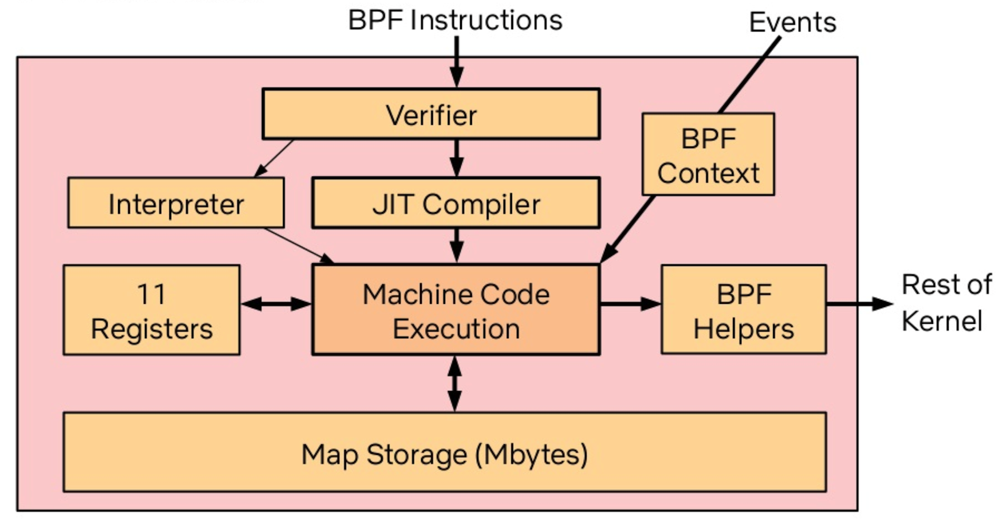

我觉得面对测试的态度是区分一个普通程序员和优秀程序员的重要标准。现如今我们的程序和服务越来越庞大，光是单元测试 TDD 之类的就已经很难保证质量，不过这些都是 baseline，所以今天聊点新的话题。

说测试之前，我们先问下自己，为什么要测试？当然是为了找 Bug。看起来这是句废话，但是仔细想想，如果我们能写出 Bug-free 的程序不就好了吗？何必那么麻烦。不过 100% 的 Bug-free 肯定是不行的，那么我们有没有办法能够尽可能地提升我们程序的质量？举个例子，我想到一个 Raft 的优化算法，与其等实现之后再测试，能不能在写代码前就知道这个算法理论上有没有问题？办法其实是有的，那就是形式化证明技术，比较常用的是 TLA+。

## TLA+

TLA+ 背后的思想很简单，TLA+ 会通过一套自己的 DSL（符号很接近数学语言）描述程序的初始状态以及后续状态之间的转换关系，同时根据你的业务逻辑来定义在这些状态切换中的不变量，然后 TLA+ 的 TLC model checker 对状态机的所有可达状态进行穷举，在穷举过程中不断检验不变量约束是否被破坏。

举个简单的例子，分布式事务最简单的两阶段提交算法，对于 TLA+ Spec 来说，需要你定义好初始状态（例如事务要操作的 keys、有几个并发客户端等），然后定义状态间跳转的操作（ Begin / Write / Read / Commit 等），最后定义不变量（例如任何处于 Committed 状态的 write ops 一定是按照 commit timestamp 排序的，或者 Read 的操作一定不会读到脏数据之类的），写完以后放到 TLC Checker 里面运行，等待结果就好。

但是，我们活在一个不完美的世界，即使你写出了完美的证明，也很难保证你就是对的。第一， Simulator 并没有办法模拟出无限多的 paticipants 和并发度， 一般也就是三五个；第二，聪明的你可能也看出来了，一般 TLA+ 的推广文章也不会告诉你 Spec 的关键是定义不变量，如果不变量定义不完备，或者定义出错，那么证明就是无效的。因此，我认为形式化验证的意义在于让工程师在写代码之前提高信心，在写证明的过程中也能更加深对算法的理解，此外，如果在 TLC Checker 里就跑出异常，那就更好了。

目前 PingCAP 应该是国内唯一一个使用 TLA+ 证明关键算法，并且将证明的 Spec 开源出来的公司，大家可以参考 [pingcap/tla-plus](https://github.com/pingcap/tla-plus) 这个 Repo，以及我们的首席架构师唐刘的这篇[博客](https://www.jianshu.com/p/721df5b4454b)了解更多。

## Chaos Engineering

如果完美的证明不存在，那么 Deterministic 的测试存在吗？我记得大概 2015 年在 PingCAP 成立前，我看到了一个 FoundationDB 关于他们的 Deterministic 测试的[演讲](https://www.youtube.com/watch?v=4fFDFbi3toc)。简单来说他们用自己的 IO 处理和多任务处理框架 [Flow](https://apple.github.io/foundationdb/flow.html) 将代码逻辑和操作系统的线程以及 IO 操作解耦，并通过[集群模拟器](https://apple.github.io/foundationdb/testing.html)做到了百分之百重现 Bug 出现时的事件顺序，同时可以在模拟器中精确模拟各种异常，确实很完美。但是考虑到现实的情况，我们当时选择使用的编程语言主要是 Go，很难或者没有必要做类似 Flow 的事情 。所以我们选择了从另一个方向解决这个问题，提升分布式环境下 Bug 的复现率，能方便复现的 Bug 就能好解决，这个思路也是最近几年很火的 Chaos Engineering。 做 Chaos Engineering 的几个关键点：

1. 定义稳态，记录正常环境下的 workload 以及关注的重要指标。

2. 定义系统稳态后，我们分为实验组和对照组进行实验，确认在理想的硬件情况下，无论如何操作实验组，最后都会回归稳态。

3. 开始对底层的操作系统和网络进行破坏，再重复实验，观察实验组会不会回归稳态。

道理大家都懂，但是实际做起来最大的问题在于如何将整个流程自动化。原因在于：一是靠手动的效率很低；二是正统的 Chaos Engineering 强调的是在生产环境中操作，如何控制爆炸半径，这也是个比较重要的问题。

先说第一个问题，PingCAP 在实践 Chaos Engineering 的初期，都是在物理机上通过脚本启停服务，所有实验都需要手动完成，耗时且非常低效，在资源利用上也十分不合理。这个问题我们觉得正好是 K8s 非常擅长的，于是我们开发了一个基于 K8s 的，内部称为 Schrodinger 的自动化测试平台，将 TiDB 集群的启停镜像化，另外将 TiDB 本身的 CI/CD，自动化测试用例的管理、Fault Injection 都统一了起来。这个项目还催生出一个好玩的子项目 Chaos Operator：我们通过 CRD 来描述 Chaos 的类型，然后在不同的物理节点上启动一个 DaemonSets，这个 DaemonSets 就负责干扰 Pod，往对应的 Pod 里面注入一个 Sidecar，Sidecar 帮我们进行注入错误（例如使用 Fuse 来模拟 IO 异常，修改 iptable 制造网络隔离等），破坏 Pod。近期我们也有计划将 Chaos Operator 开源。

第二个问题，其实在我看来，有 Chaos Engineering 仍然还是不够的，我们在长时间的对测试和质量的研究中发现提升测试质量的关键是如何发现更多的测试 workload。在早期我们大量依赖了 MySQL 和相关社区的集成测试，数量大概千万级别，这个决定让我们在快速迭代的同时保证质量，但是即使这样还是不够的，我们也在从学术界寻求答案.例如引入并通过官方的 Jepsen Test ，再例如通过 SQLfuzz 自动生成合法 SQL 的语句加入到测试集中，这个思路在最近我们的一次 Hackathon 项目中有一个很完美的落地，可以看看这篇介绍这个项目的文章[《你呼呼大睡，机器人却在找 bug？》](https://pingcap.com/blog-cn/sqldebug-automatically/)。

总之，比起写业务逻辑，在分布式环境下写测试 + 写测试框架花费的精力可能一点都不少，甚至可能多很多（如果就从代码量来说，TiDB 的测试相关的代码行数可能比内核代码行数多一个数量级），而且这是一个非常值得研究和投资的领域。另外一个问题是如何通过测试发现性能回退。我们的测试平台中每天运行着一个名为 benchbot 的机器人，每天的回归测试都会自动跑性能测试，对比每日的结果。这样一来我们的工程师就能很快知道哪些变更导致了性能下降，以及得到一个长期性能变化趋势。

## eBPF

说完测试，另外一个相关的话题是 profiling 和分布式 tracing。tracing 看看 Google 的 Dapper 和开源实现 OpenTracing 就大概能理解，所以，我重点聊聊 profiling。最近这几年我关注的比较多的是 eBPF（extended BPF）技术。想象下，过去我们如果要开发一个 TCP filter，要么就自己写一个内核驱动，要么就用 libpcap 之类的基于传统 BPF 的库，而传统 BPF 只是针对包过滤这个场景设计的虚拟机，很难定制和扩展。

 图 1 BPF 工作原理

 图 2 eBPF 架构图

在这个背景下，eBPF 应运而生，eBPF 引入了 JIT 和寄存器，将 BPF 的功能进一步扩充，这背后的意义是，我们在内核中有一个安全的、高性能的、基于事件的、支持 JIT 的字节码的虚拟机！这其实极大地降低了拓展内核能力的门槛，我们可以不用担心在驱动中写个异常把内核搞崩，我们也可以将给 llvm 用的 clang 直接编译成 eBPF 对象，社区还有类似 bcc 这样的基于 Python 的实用工具集……

过去其实大家是从系统状态监控、防火墙这个角度认识 eBPF 的。没错，性能监控以及防火墙确实是目前 eBPF 的王牌场景，但是我大胆地预测未来不止于此，就像最近 Brendan Gregg 在他的 blog 里喊出的口号：BPF is a new type of software。可能在不久的未来，eBPF 社区能诞生出更多好玩的东西，例如我们能不能用 eBPF 来做个超高性能的 web server？能不能做个 CDN 加速器？能不能用 BPF 来重定义操作系统的进程调度？我喜欢 eBPF 的另一个重要原因是，第一次内核应用开发者可以无视内核的类型和版本，只要内核能够运行 eBPF bytecode 就可以了，真正做到了一次编译，各个内核运行。所以有一种说法是 BPF is eating Linux，也不是没有道理 。

PingCAP 也已经默默地在 BPF 社区投入了很长时间，我们也将自己做的一些 bcc 工具开源了，详情可以参考 [pingcap/kdt](https://github.com/pingcap/kdt) 这个 repo。其中值得一提的是，我们的 bcc 工具之一 drsnoop 被 Brendan Gregg 的新书收录了，也算是为社区做出了一点微小的贡献。

PingCAP 也已经默默地在 BPF 社区投入了很长时间，我们也将自己做的一些 bcc 工具开源了，详情可以参考 pingcap/kdt 这个 repo。其中值得一提的是，我们的 bcc 工具之一 drsnoop 被 Brendan Gregg 的新书收录了，也算是为社区做出了一点微小的贡献。

上面聊的很多东西都是具体的技术，技术的落地离不开部署和运维，分布式系统的特性决定了维护的复杂度比单机系统大得多。在这个背景之下，我认为解法可能是：不可变基础设施。

云和容器的普及让 infrastructure as code 的理念得以变成现实，通过描述式的语言来创建可重复的部署体验，这样可重用的描述其实很方便在开源社区共享，而且由于这些描述几乎是和具体的云的实现无关，对于跨云部署和混合数据中心部署的场景很适合。有些部署工具甚至诞生出自己的生态系统，例如 Terraform / Chef / Ansible。有一种说法戏称现在的运维工程师都是 yaml 语言工程师，其实很有道理的：人总是会出错，且传统的基于 shell 脚本的运维部署受环境影响太大，shell 天然也不是一个非常严谨的语言。描述意图，让机器去干事情，才是能 scale 的正道。
