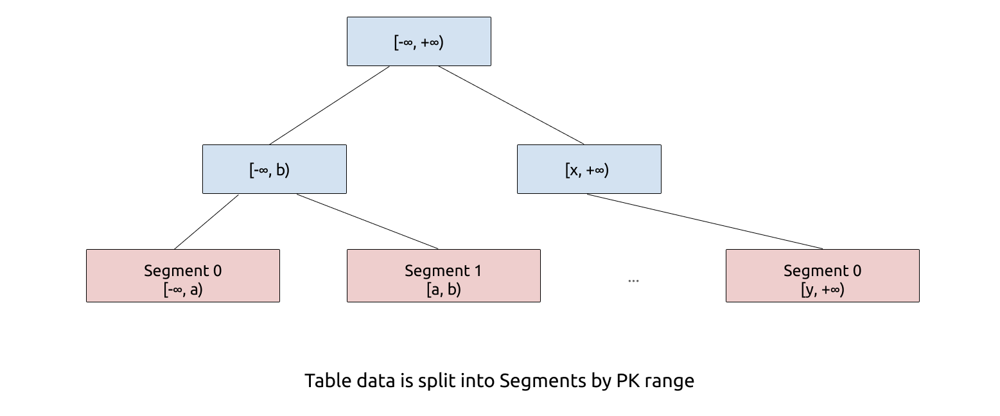
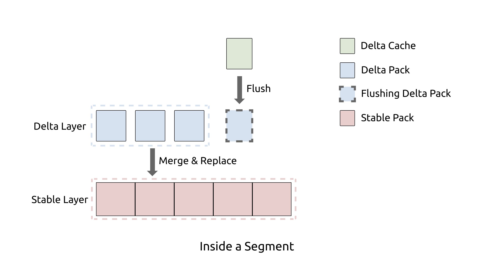
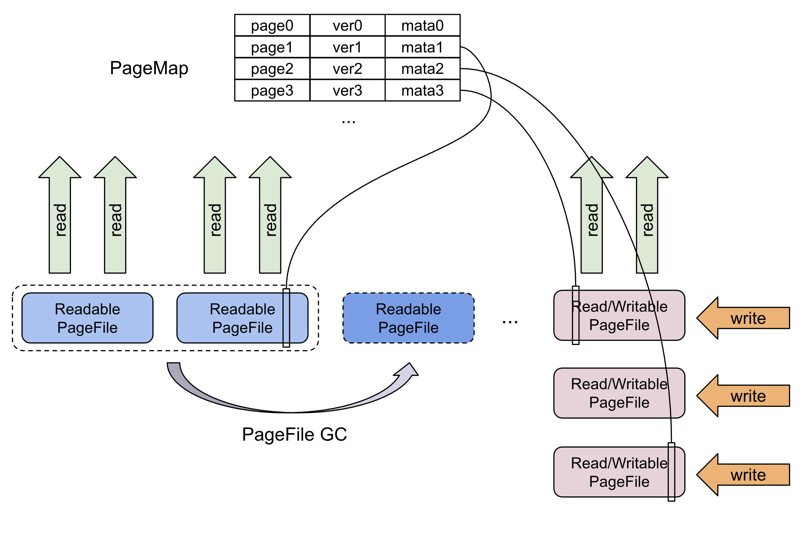
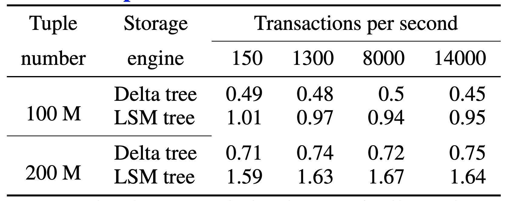
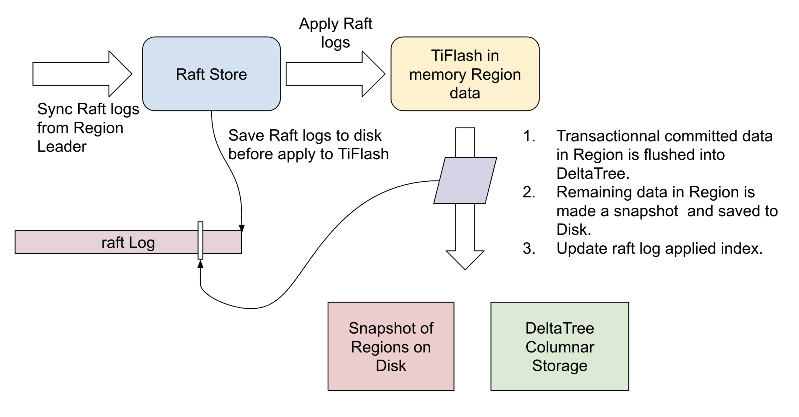

作者：韦万

[TiDB](https://docs.pingcap.com/zh/tidb/stable) 是一款分布式 HTAP 数据库，它目前有两种存储节点，分别是 TiKV 和 TiFlash。TiKV 采用了行式存储，更适合 TP 类型的业务；而 TiFlash 采用列式存储，擅长 AP 类型的业务。TiFlash 通过 raft 协议从 TiKV 节点实时同步数据，拥有毫秒级别的延迟，以及非常优秀的数据分析性能。它支持实时同步 TiKV 的数据更新，以及支持在线 DDL。我们把 TiFlash 作为 Raft Learner 融合进 TiDB 的 raft 体系，将两种节点整合在一个数据库集群中，上层统一通过 TiDB 节点查询，使得 TiDB 成为一款真正的 HTAP 数据库。

为了在列式存储上支持实时更新，我们专门为 TiFlash 研发了新的列存引擎 Delta Tree。它可以在支持高 TPS 写入的同时，仍然能保持良好的读性能。本文为大家详细解释 Delta Tree 的设计思路，欢迎讨论。

## 整体架构

Delta Tree 的架构设计充分参考了 B+ Tree 和 LSM Tree 的设计思想。从整体上看，Delta Tree 将表数据按照主键进行 range 分区，切分后的数据块称为 Segment；然后 Segment 内部则采用了类似 LSM Tree 的分层结构。分区是为了减少每个区的数据量，降低复杂度，我们后面会看到这个设计带来的巨大优势。

### Segment

Segment 的切分粒度通常在150 万行左右，远超传统 B+ Tree 的 Leaf Node 的大小。Segment 的数量在一台机器上通常在 10 万以内，所以我们可以把 Segment 的元信息完全放在内存，这简化了工程实现的复杂度。和 B+ Tree 的叶子节点一样，Segment 支持 Split、Merge。在初始状态，一张表只存在一个 range 为 [-∞, +∞) 的 Segment。

### 2 Levels LSM Tree

在 Segment 内部，我们通过类似 LSM Tree 的分层的方式组织数据。 因为 Segment 的数据量相对于其他 LSM Tree 实现要小的多，所以 Delta Tree 只需要固定的两层，即 Delta Layer 和 Stable Layer，分别对应 LSM Tree 的 L0 和 L1。我们知道对于 LSM Tree 来说，层数越少，写放大越小。默认配置下，Delta Tree 的理论写放大（不考虑压缩）约为 19 倍。因为列式存储连续存储相同类型的数据，天然对压缩算法更加友好，在生产环境下，Delta Tree 引擎常见的实际写放大低于 5 倍。

上面介绍了 Delta Tree 的整体架构，下面我们对 Segment 的内部设计细节做一个详细的讨论。

### Pack

Segment 内部的数据管理单位是 Pack，通常一个 Pack 包含 8K 行或者更多的数据。关系型数据库的 schema 由多个列定义组成，每个列定义包括 column name，column id，column type 和 default value 等。由于我们支持 DDL，比如加列、删列、改数据类型等操作，所以不同的 Pack schema 有可能是不一样的。Pack 的数据也由列数据（column data）组成，每个列数据其实就是一维数组。Pack 除了主键列 Primary Keys(PK) 以及 schema 包含的列之外，还额外包含 version 列和 del_mark 列。version 就是事务的 commit 时间戳，通过它来实现 MVCC。del_mark 是布尔类型，表明这一行是否已经被删除。

将 Segment 数据分割成 Pack 的作用是，我们可以以 Pack 为 IO 单位和索引过滤单位。在数据分析场景，从存储引擎获取数据的方式都是 Scan。为了提高 Scan 的性能，通常我们的 IO 块要比较大，所以每次读 IO 可以读一个或者多个 Pack 的数据。另外通常在分析场景，传统的行级别的精确索引通常用处不大，但是我们仍然可以实现一些简单的粗糙索引，比如 Min-Max 索引，这类索引的过滤单位也是 Pack。

如果你熟悉 TiDB 的架构，会了解 TiKV 的数据是以 Region 为调度单位，Region 是数据以 range 切分出来的虚拟数据块。而 Delta Tree 的 Pack 内部的数据是以 `(PK, version)` 组合字段按升序排序的，与 TiKV 内的数据顺序一致。这样可以让 TiFlash 无缝接入 TiDB 集群，复用原来的 Region 调度机制。

### Delta Layer

Delta Layer 相当于  LSM Tree 的 L0，它可以认为是对 Segment 的增量更新，所以命名为 Delta。与 LSM Tree 的 MemTable 类似，最新的数据会首先被写入一个称为 Delta Cache 的数据结构，当写满之后会被刷入磁盘上的 Delta Layer。而当 Delta Layer 写满之后，会与 Stable Layer 做一次 Merge（这个动作称为 Delta Merge）得到新的 Sable Layer。

### Stable Layer

Stable Layer 相当于 LSM Tree 的 L1，是存放 Segment 的大部分数据的地方。它由一个不可修改的文件存储，称为 DTFile。一个 Segment 只有一个 DTFile。Stable Layer 同样由 Pack 组成，并且数据以 `(PK, version)` 组合字段按升序排序。不一样的是，Stable Layer 中的数据是全局有序，而 Delta Layer 则只保证 Pack 内有序。原因很简单，因为 Delta Layer 的数据是从 Delta Cache 写下去的，各个 Pack 之间会有 overlap；而 Stable Layer 的数据则经过了 Delta Merge 动作的整理，可以实现全局有序。

当 Segment 的总数据量超过配置的容量上限，就会以 Segment range 的中点为分裂点，进行 split，分裂成两个 Segment；如果相邻的两个 Segment 都很小，则可能会被 merge 在一起，变成一个 Segment。

## 存储方式

Delta Tree 引擎的 Delta Layer 和 Stable Layer 在磁盘的存储方式并不一致，前者使用 PageStorage (PS) 存储，后者使用 DTFile 存储。

### PageStorage

PS 类似与对象存储，它存储和管理数据块 Page，Page 其实是一段 bytes。它设计用来存储 Delta Tree 的 Delta Layer 的 Pack 数据以及 Segment 的元数据。PS 支持 Page Get、Insert、Delete、Update 操作，并且支持把多个操作组合为一个WriteBatch，实现原子性写入。Page 存储在 PageFile 之中，一个 PageFile 可以存储多个 Page。我们在内存中维护了一份 Page 的元数据 PageMap，通过它可以定位到 Page 存储的具体 PageFile 以及文件 offset，从而支持 Page 的随机读取。

PS 可能会存在一个或者多个 Writable PageFile，当 Writable PageFile 写满之后，会变成 Readonly PageFile。对 Page 的所有更新操作是直接写到 PageFile 的末尾，比如 Page 的 Update 操作，是通过在 Writable PageFile 写一个新的 Page，然后在内存的元数据表中，将 PageId 指向新的 Page。随着时间的推移，PageFile 中会出现较多无效数据段，所以我们设计了 GC 线程，在后台把利用率低的 PageFile 合并，从而提升读取效率及回收磁盘空间。

Delta Layer 中的 Pack 会被序列化成 Page，存储在 PS 中。通常业务的查询只会涉及到一个表的部分列，所以 PS 也支持只读 Page 中的一部分数据。

### DTFile

DTFile 在文件系统上的形式是一个文件夹，文件夹内部是标准的列存格式，即一个列使用一个文件来存储。DTFile 是只读的，且对它的读取模式都是顺序读取，适合存储 Stable Layer 的数据。DTFile 在三种情况被生成：分别是  Delta Merge、Segment Split 和 Segment Merge。

- Stable Layer 适合用 DTFile 存储 ，而 Delta Layer 更适合用 PageStorage 存储。主要考虑到它们在以下几方面的差异：

- DTFile 用于一个列使用一个文件存储，所以如果需要读写连续的 Pack，可以做列级别的 IO 合并，这非常适合 Stable Layer 的读取和生成模式。

- DTFile 写入完成后是只读文件，如果用于存储 Delta Layer 数据，只能用 Pack 和 DTFile 一一对应的方式，这会造成大量小文件，影响系统性能。而 PageStorage 把多个 Page 合并存储，没有小文件问题。

- PageStorage 可以对 Page 进行随机读取，和 Delta Layer 的读取模式相契合。

- PageStorage 可以减少写过程中产生的 IO 次数。DTFile 在写入的时候，需要打开和列数一样多的文件，每个列至少会产生一个 IO。由于重新生成 Stable Layer 的频率并不高，并且写入多个 Pack 可以做列级别的 IO 合并，所以每次的 IO 大小是合适的，使用 DTFile 存储比较合适。对于 Delta Layer，每次只会写一个 Pack，如果用 DTFile 存储，IO 单位只能是 Pack 的一个列；如果用 PageStorage 存储，我们可以把 Pack 的所有列数据全部序列化为 Page 一次性写入磁盘，从而减少 IO 次数。

## 写优化

TiFlash 目前主要面向实时 OLAP 场景，设计上需要同时支持高频写入和批量写入。高频写入是为了能实时同步 TiKV 在 OLTP 场景下的更新操作；而在数据的批量导入场景，以及刚刚开启 TiFlash 列存同步之后，都需要在短时间内写入大批量数据，所以 Delta Tree 也需要支持批量写入。我们分别对这两种场景做了不同的处理，以达到最好的效果。

### Delta Cache

为了缓解高频写入的 IOPS 压力，我们在 Delta Tree 的 Delta Layer 中设计了内存 cache，称为 Delta Cache。更新会先写入 Delta Cache，写满之后才会被 flush 到磁盘。而批量写入是不需要写 Delta Cache 的，这种类型的数据会被直接写入磁盘。

你可能会注意到，Delta Cache 的设计有丢数据的风险。因此一般存储引擎在写入数据之前需要先写入 WAL，在重启之后从上一个 flush point 恢复。但由于 Delta Tree 是为 TiDB 设计的列存引擎，它充分利用了 TiDB 的特点，即 raft 协议。在 raft 协议中，任何一个更新，会先写入 raft log，等待大多数副本确认之后，才会将这个更新 apply 到状态机（即数据库存储引擎）。所以我们直接利用 raft log 实现了 WAL，即在 flush 之后才更新 raft log applied index。

### 持续写入能力

和 LSM Tree 类似，Delta Tree 在数据写入的过程中，使用后台线程不断把 Delta Layer merge 到 Stable Layer 种。目的是为了将 Delta Layer 的数据量控制在一定的比例以内，从而保持良好的读性能。Delta Merge 是 Delta Tree 的写放大（write amplification）的主要因素，Delta Tree 的写放大 write amplification ~= `(Segment 平均大小 / Delta 限额)`。所以 Delta Merge 频率越高，写放大越大，Delta Layer 比例越小，读性能越好。

TiFlash 的设计理念是希望尽可能的保持写入能力，在 写入性能 和 读取性能 之间寻找平衡点。比如在业务写入量特别大的情况下，写入速度太快，如果后台 Delta Merge 跟不上，就有可能发生 write stall，即阻塞前台的写入。在这种情况下，Delta Tree 会动态的限制写入速度，并且减小 Delta Merge 频率，减小写放大，使得写入和后台 Delta Merge 重新达到平衡。这会牺牲部分读和写的性能，但是缓解了极端情况下完全无法写入的问题，业务上体验更好。

## 读优化

Delta Tree 没有直接做成一个列存的 LSM Tree 实现，而是折腾了上面一堆设计，很大一部分原因是为了做读加速。Delta Tree 的 Segment 分区设计可以减小读放大，而 Segment 分区内的双层结构也方便做读加速。

从存储引擎中读取数据对应执行计划中的 Scan 算子。它的主要任务是根据一段  range （比如 [x, y)），返回一个根据 `(PK, version)` 排好序的数据。过程中主要有三个耗时的部分，而 Delta Tree 的设计对它们都有优化效果。

**A**. 数据本身的读 IO 与解压缩的耗时。

**B**. 对多条排序数据流进行多路归并算法本身的消耗，比如常见的最小堆算法。

**C**. 多路归并之后把多个数据流的数据 copy 到输出流。

### 减少读放大

我们知道 TiDB 集群的数据，是以 Region 为单位管理的。我们通过调度 Region 的副本在集群的存储节点（即 TiKV 和 TiFlash）间合理分布，以获得负载均衡和数据高可用。由于 Region 只是逻辑分块，并且在一个节点的 Region 并不是连续的。所以当 Scan 涉及大量 Region ，必然会有读放大。显然，如果 Region 的数据分布在越多的文件，它的读放大越大。即层数越多，读放大越大。Delta Tree 的通过 Segment 分区降低了区内数据量，减少层数，从而减少读放大，即优化了 **A** 部分的耗时。

### 读索引 Delta Index

既然多路归并比较耗时，那我们是否可以避免每次读都要重新做一次呢？答案是可以的。事实上有一些内存数据库已经实践了类似的思路。具体的思路是，第一次 Scan 完成后，我们把多路归并算法产生的信息想办法存下来，从而使下一次 Scan 可以重复利用，只需要处理增量部分即可。这份可以被重复利用的信息我们称为 Delta Index，它由一棵 B+ Tree 实现。Delta Index 的设计经过了多次设计迭代，并参考了许多现有的数据库的方案。

1. 首先我们把 Stable Layer 和 Delta Layer 并排放在一起，这时候每一行数据就拥有了可以用于索引的 Tuple Id。然后用类似二级索引的思路，构建一个在内存的 B+ Tree，B+ Tree 的叶子节点的 Entry 同样按照 `(PK, version)` 的升序排序。Entry 的数据内容为 `((PK, version), is_insert, Tuple Id)`。is_insert 表示是 Insert 还是 Delete。

2. 这时候 Segment 内的每一行需要有一个对应的 Entry，内存压力很大，需要做压缩。观察发现，`(PK, version)` 并不是必须的，因为我们有 Tuple Id，可以从原始数据获得，不需要放到 Delta Index 中。这对于 PK 比较大的场景比较关键。

3. 而 Tuple Id 存在很多连续递增 Id 的现象，因为在 Segment 中，Stable Layer 的数据通常占了绝大多数。所以连续的 N个 Stable Entry，使用一个 `(Tuple Id, N)` 代替即可。

4. 进一步观察，Stable Layer 数据的 Tuple Id 一定是按增序排序的，因为它们在 Stable Layer 中是全局排序的。所以我们可以只记录 Delta Layer 的数据，并额外记录两个 Delta Entry 之间插入了多少个 Stable Tuple。所以需要把 Stable Layer 和 Delta Layer 的 Tuple Id 进行区分，分别称为 Stable Id 和 Delta Id。

最终的 Entry 记录的格式为 `(is_insert, Delta Id, (Stable Id, N))`，Entry 数据量等于 Delta Layer 的数据量。通常情况下，Delta Layer 的数据量占总数据量的 3% 以内，而一个 Entry 只需要 16 个字节，若按照单节点存放 100 亿数据来估算，大概需要 4.5 GB 内存，内存开销还可以接受。

拥有了 Delta Index 记录的信息，Scan 操作就可以很方便的把 Delta Layer 和 Stable Layer 合并到一起，输出一个排好序的 Stream。这里有个小问题，即在两次 Scan 之间，可能会有新的数据写进了 Delta Layer，所以我们还是需要处理这部分增量数据，把他们更新到 Delta Index 中。由于上一次的结果可以被下一次重复利用，从而平摊了开销，即我们优化了 **B** 部分的耗时。

对于 **C** 部分的耗时，Delta Tree 的主要优化是可以对连续的 Stable Layer 的数据做批量 copy，从而节省 CPU cycle。LSM Tree 的多路归并算法当然也可以批量 copy，只是实现起来比较麻烦。且因为 LSM Tree 下层和上层之间的数据量比为 10 倍，而 Delta Tree 通常是 37 倍以上，因此 Delta Tree 批量 copy 的效果会比 LSM Tree 更好。

### Delta Tree vs LSM Tree

TiFlash 一开始尝试过基于 LSM Tree 架构实现，但是后面发现它的读性能并不能满足要求，并且还存在其他的问题。所以才启动了 Delta Tree 项目。下面是 Delta Tree 与基于 LSM Tree 实现的列存引擎在不同数据量（Tuple number）以及不同更新 TPS (Transactions per second) 下的读 (Scan) 耗时对比。

下面是在使用 ontime 数据集，不同 SQL 的耗时对比。可以看到 Delta Tree 在大部分情况下有更大的优势，这不仅归功于 Delta Tree 有更好的 Scan 性能，也因为它支持了粗糙索引（如 Min-Max），可以避免读无关数据。

下面是 TiFlash 使用 Delta Tree 引擎，与其他数据库的对比。

## 如何处理事务

开启了 TiFlash 副本的 TiDB 集群，同样支持事务，并保证和原来 TiKV 一样的隔离级别，这在一个 AP 数据库中是比较少见的，详细可以参考 [TiDB 文档](https://docs.pingcap.com/zh/tidb/stable/transaction-overview)。可能有些同学比较好奇 TiFlash 是怎么做到的。这里简单介绍比较重要的点，有兴趣的同学可以去看我们刚刚发在 VLDB 的论文 ["TiDB: A Raft-based HTAP Database"](https://drive.google.com/file/d/1-_ljgDrqigrKd-seZFgUmhZyNROJoZGN/view)。

TiFlash 目前只实时同步 TiKV 的修改，在事务过程中并不会提供数据，所以它不需要提供点查能力，这避开了列存的弱点。

和 TiKV 一样，Delta Tree 中的每一条数据都有版本号字段 version，这个 version 就是事务 的提交时间戳 commit_ts。所以在查询过程中，根据 query_ts 就可以过滤出符合  `version <= query_ts` 的 data snapshot，实现 MVCC。

TiDB 使用的分布式事务模型名为 Percolator，它在事务过程中需要用到锁，一般来说这些锁是需要持久化的。TiKV 当然可以把这些锁持久化到自己的存储 RocksDB 中，但是 TiFlash 的列存 Delta Tree 无法高效支持 K-V 模式的高 TPS、低延迟的读操作。TiFlash 目前的解决方案也很简单，既然这些锁不方便持久化，那就放内存好了。我们只会把在事务中已经提交了的修改写入 Delta Tree 存储，没有提交的事务放在内存。需要注意的是，这里并不担心这些锁数据和未提交数据的丢失，有两个机制保障：

1. 如前所述，所有的数据都事先落地到了 raft log。内存没有被持久化的部分，重启后可以从 raft log 恢复。

2. 在内存的状态，包括锁和没有提交的数据，会定期被保存一份副本到磁盘，然后向前推进 raft log applied index。重启后从磁盘恢复副本到内存。

## 结语

一直以来，在线上业务系统和分析系统之间存在着一个巨大的技术鸿沟，即数据的更新无法实时顺畅的流动。核心原因是，分析数据库的存储通常更新能力非常差，想象一下把 MySQL binlog 实时同步到 Hive 的痛苦。Delta Tree 列式存储引擎完美的解决了这个问题，让最适合分析场景的列式存储也能实时更新。

而 TiDB 通过引入了 TiFlash，在一个数据库系统内集成了行存与列存，让实时业务数据分析变得非常简单。你甚至可以在一个 SQL 之内同时使用行存与列存的数据，并且保证数据严格一致。在 TiDB 中，获得这个能力只需要一条 [SQL](https://docs.pingcap.com/zh/tidb/stable/use-tiflash#%E6%8C%89%E8%A1%A8%E6%9E%84%E5%BB%BA-tiflash-%E5%89%AF%E6%9C%AC): `alter table my_table set tiflash replica 1;`。
