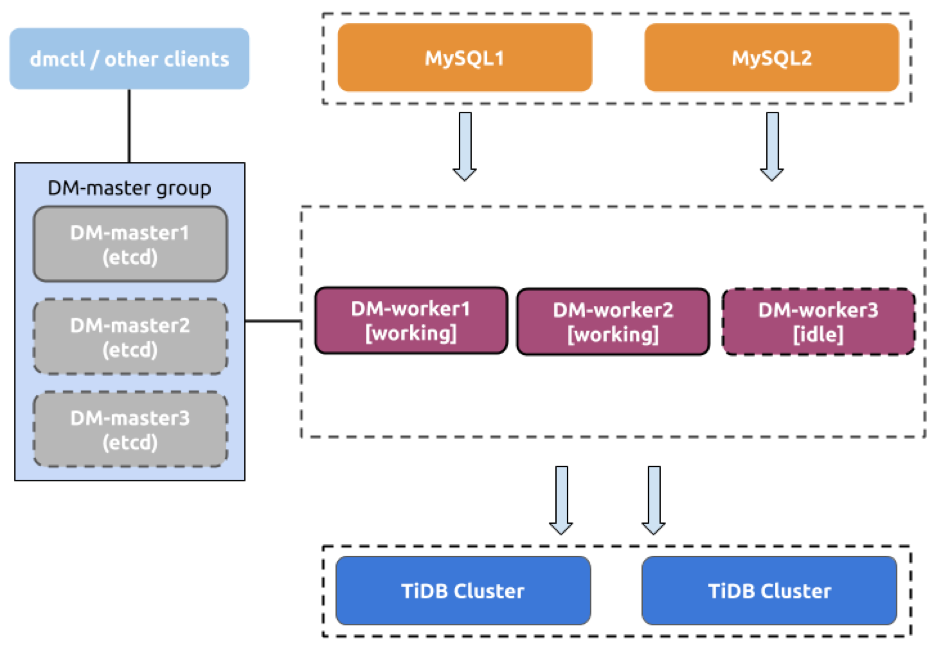
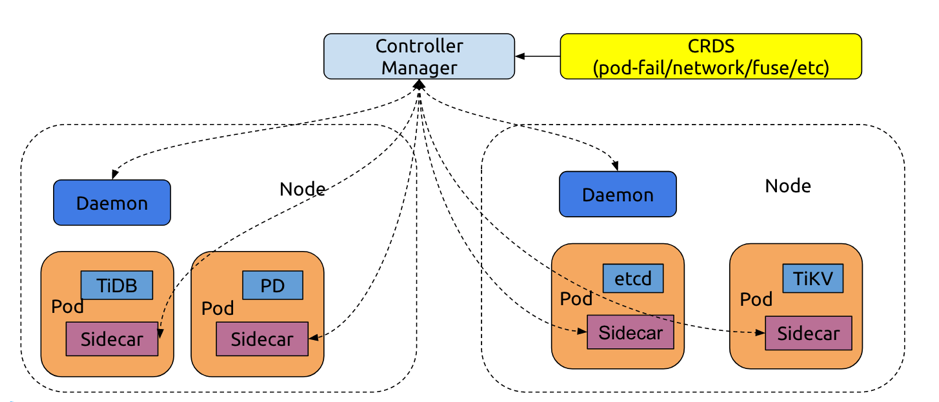

对于 80 后的男生来说，『七龙珠』是一部绕不开的经典漫画，里面的主角孙悟空掌握了一项强大的必杀技 - 元气弹，他通过收集万物的能量，汇聚成一个有巨大破坏力的能量球，然后发射给反派将其打败。每每在漫画里面看到这样的情况，年少的我就激动不已，梦想着有一天也可以自己举起双手，汇聚出元气弹。

当然，现在我们知道举起双手是不可能造出元气弹了，但从另一方面来说，如果我们能很好地利用好大家的力量，统一的往一个方向努力，解决某一个特定的问题，这不就是另一种元气弹的形式吗？在 PingCAP，我们每个季度都会做这样一次活动，叫做 Special Week（后面简称 SW），在 2019 年第四季度，我们 SW 的主题是 - Tools matter，很直白，就是工具很重要。

PingCAP 一直致力于跟社区一起构建 TiDB 的生态，这其中 Tools 扮演了非常重要的角色。大家可能会用 TiDB Data Migration（以下简称  DM）将 MySQL 的数据迁移到 TiDB，或者使用 TiDB Binlog 工具将 TiDB 的数据同步到下游其他的服务。

这次 Special Week 希望集思广益，从其他角度来改进 Tools，降低大家使用 TiDB 的门槛。

为了将 SW 相关的进度公开到社区。我们创建了一个 [Github project](https://github.com/orgs/pingcap/projects/6) 来放置所有的开发任务，研发的同学自行组队去挑战相关的任务。经过了 5 天的全力开发，我们取得了一些不错的成绩，下面跟大家一起看看我们有了哪些不错的成果。

## 增量备份

在这次活动中为TiDB 新推出的 [分布式快速备份和恢复工具](https://pingcap.com/docs-cn/dev/how-to/maintain/backup-and-restore/br/)（简称：BR） 实现了增量备份和恢复功能。效果展示如下：

搞定增量备份和恢复功能，对于完善基于 TiDB Binlog 的灾备集群方案具有重要意义。大家都知道 TiKV 使用 Raft 协议实现数据多副本来保证 TiDB 集群的数据安全，而 TiDB Binlog 某种意义上是 TiDB 集群的另一份冗余数据，如果我们再实现 TiDB Binlog 多副本，复杂且意义不大。但是当 TiDB Binlog 出现数据损坏，对灾备集群等使用场景影响是重大的。增量备份和恢复功能可以快速填补上 TiDB Binlog 数据损坏的时间段数据，大大缓解方案上的这一缺陷，疗效堪称快速续命丸。

## DM 高可用

让TiDB 自研的 [DM](https://github.com/pingcap/dm) （从 MySQL 迁移数据到 TiDB 的工具） 支持了高可用的特性，使得用户免于遭受在节假日甚至凌晨发现挂掉一台服务器而紧急 OnCALL 的苦恼，也为 DM 可以用在一些关键场景中做了铺垫。

下图是实现 DM 高可用的架构图:

## Tools Chaos 测试

Chaos Mesh 是我们最新开发的，基于 Kubernetes（K8s） 的一套 Chaos Engineering 解决方案，只要你的服务能跑在 K8s 上面，就可以直接集成 Chaos Mesh 进行 chaos 测试。

在这次 SW，我们将 DM、TiDB Binlog、BR 以及 CDC 都成功地跑在了 K8s 上面，然后使用 Chaos Mesh 进行了测试，也发现了一些问题，改善了整个 Tools 的稳定性。

我们在 2019 月 12 月 31 日 正式开源 Chaos Mesh，项目地址：[https://github.com/pingcap/chaos-mesh](https://github.com/pingcap/chaos-mesh)，欢迎大家使用。

## 生态合作

### PITR ( Point in Time Recovery)

这个项目是跟某互联网公司一起进行的，主要是将 Binlog 的增量备份进行合并，生成一个更轻量级的备份文件，加速同步的速度（项目地址 [https://github.com/lvleiice/Better-PITR](https://github.com/lvleiice/Better-PITR) ）。

PITR 的核心功能在之前 PingCAP 举办的 2019 Hackathon 中已经完成，详见《[直击备份恢复的痛点：基于 TiDB Binlog 的快速时间点恢复](https://pingcap.com/blog-cn/fast-pitr-based-on-binlog/)》，在这次 SW 我们将其进一步完善增强，主要包括：

1.  增加 CI，提升测试覆盖率。

2.  修复读取历史 DDL 报错问题。

3.  对压缩前预处理阶段提速，200 条 DDL 测试下，相比之前，提速 68 倍。

后续，我们仍然会继续跟社区一起合作完成该项目，我们也在 Slack 上面建立了相关的 [working group](https://tidbcommunity.slack.com/?redir=%2Farchives%2FCRH5594F8)，欢迎感兴趣的同学参与。

### TiKV Raw 模式备份恢复

除了直接使用 TiDB，用些用户也会直接使用 TiKV，现阶段我们只提供了 TiDB 的备份工具 - BR，并没有单独针对 TiKV。

所以在这次 SW 我们跟一点资讯一起合作，让 BR 支持了 TiKV 的备份和恢复。现在已经完成了 BR 这一段的开发，还剩 TiKV 这边一点工作的收尾，欢迎感兴趣的同学关注 [https://github.com/pingcap/br/issues/86](https://github.com/pingcap/br/issues/86)。

### 基于 DM 支持 Syncer

为了方便用户将 MySQL 的数据同步给 TiDB，我们早期开发了 syncer 这个工具，后来为了支持更强大的功能，我们开发了一套新的同步工具 - DM。DM 易用性，稳定性更强，并支持高可用。后期我们会逐步废弃掉 syncer ，不再同时维护 DM 和 syncer 两套代码。但出于历史原因一些用户仍然在使用 syncer，如何方便地从 syncer 迁移到 DM，是我们这次 SW 要解决的问题。

我们跟某知名互联网金融公司合作，基于 DM 的 sync 模块开发另一个 syncer，兼容之前老的 syncer，让用户能无缝迁移。

现在相关的开发进度在 [https://github.com/pingcap/dm/pull/433](https://github.com/pingcap/dm/pull/433)，欢迎大家参与。

## 写在最后

经过接近一年的探索，Special Week 在 PingCAP 已经逐渐成为一个独特的文化。刚刚结束的 Q4 Sepcial Week 把 PingCAP 与用户和开源社区紧密结合在了一起。我们希望与社区在未来有更多的合作，完成更多有价值的项目。这也是为什么大家可以看到这次的 SW 的大部分讨论，设计，进度都公开到 Github 的原因。

我们会整合这次 Sepcial Week 中产生的项目，建立一些社区可以参与的工作组，欢迎大家从 [这里](https://github.com/pingcap/community/tree/master/working-groups) 找到自己感兴趣的工作组，与我们一起构建 TiDB 生态工具社区。

