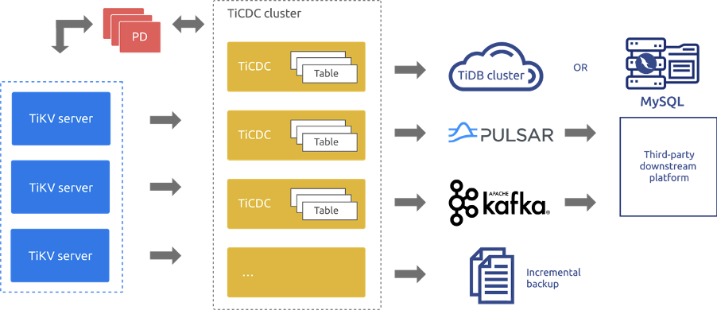
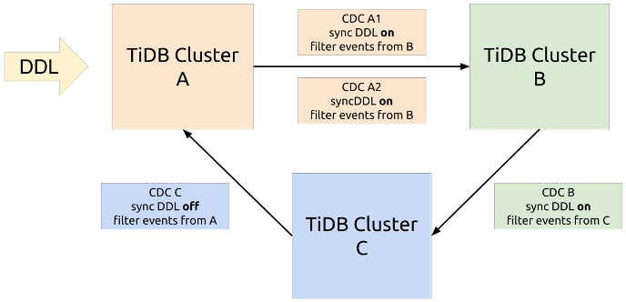

TiCDC 是一个通过拉取 TiKV 日志实现的 TiDB 增量数据同步工具，具有还原数据到与上游任意 TSO 一致状态的能力，同时提供开放数据协议，支持其他系统订阅数据变更。TiCDC 运行时是无状态的，借助 PD 内部的 etcd 实现高可用。TiCDC 集群支持创建多个同步任务，向多个不同的下游进行数据同步。

在 4.0 之前，TiDB 提供 TiDB Binlog 实现向下游平台的近实时复制，在 TiDB 4.0 中，引入 TiCDC 作为 TiDB 变更数据的捕获框架。 TiCDC 首个 GA 版本随着 TiDB 4.0.6 正式发布，具备生产环境的运行能力，主要优势如下：

TiCDC 系统架构图

- **数据高可用**：TiCDC 从 TiKV 获取变更日志，意味着只要 TiKV 具备高可用就能保证数据的高可用，遇到 TiCDC 全部异常关闭的极端情况，后续启动还能正常获取数据。

- **水平扩展**：支持组建多 TiCDC 节点集群，将同步任务均匀地调度到不同节点上，面对海量数据时，可以通过添加节点解决同步压力过大的问题。

- **自动故障转移**：当集群中的一个 TiCDC 节点意外退出时，该节点上的同步任务会自动调度到其余的 TiCDC 节点上。

- **支持多种下游系统和输出多种格式**：目前已经支持兼容 MySQL 协议的数据库、Kafka 和 Pulsar 分布式流处理系统，支持输出的格式有 [Apache Avro](http://avro.apache.org/)，[Maxwell](http://maxwells-daemon.io/) 和 [Canal](https://github.com/alibaba/canal)。 

## 应用场景

### 两中心主备

数据库作为企业 IT 的核心，在稳定运行的基础之上，数据库的容灾建设成为保障业务连续性的前提条件。

综合考量业务关键性、成本等因素，部分用户希望核心数据库只需要完成主备站点的容灾即可，利用 TiCDC 构建 TiDB 主备站点的容灾方案成为理想之选。该方案基于 TiCDC 的数据同步功能，可以适配两个中心长距离间隔、网络延迟较大的场景，进行两个数据中心 TiDB 集群之间的数据单向同步，保障事务的最终一致性，实现秒级 RPO 。

### 环形同步与多活

利用 TiCDC 实现三个 TiDB 集群之间的环形同步，构建 TiDB 多中心的容灾方案。当一个数据中心的机柜发生意外掉电，可以把业务切换到另一个数据中心的 TiDB 集群，实现事务的最终一致性和秒级 RPO。为了分担业务访问的压力，在应用层可以随时切换路由，将流量切换到目前负载较小的 TiDB 集群提供服务，实现负载均衡，在满足数据高可用的同时提升容灾能力。

TiCDC环形同步拓扑图

### 数据订阅

TiCDC 为下游数据消费端提供实时、高吞吐、稳定的数据订阅服务，通过开放数据协议（Open Protocol ）与 MySQL、Kafka、Pulsar、Flink、Canal、Maxwell 等多种异构生态系统对接，满足用户在大数据场景中对各类数据的应用与分析需求，广泛适用于日志收集、监控数据聚合、流式数据处理、在线和离线分析等场景。

## 最佳实践

### 小红书

小红书是年轻人的生活方式平台，用户可以通过短视频、图文等形式记录生活点滴，分享生活方式，并基于兴趣形成互动。截至到 2019 年 10 月，小红书月活跃用户数已经过亿，并持续快速增长。

小红书在报表分析、大促实时大屏、物流仓储、电商数据中台、内容安全审核分析等多个场景使用 TiDB 承载核心业务。在内容安全审核分析场景，上游 TiDB 承载安全审核数据的实时记录，由线上应用直接写入，实现实时数据的监控和分析。

在审核数据分析的业务流程中，通过 TiCDC 抽取 TiDB 的实时流数据，接到下游 Flink 进行实时计算聚合，计算结果再次写入 TiDB，用于审核数据的分析、人工效率的分析和管理等。小红书通过调用 TiCDC 内部 API（[Sink Interface](https://pkg.go.dev/github.com/pingcap/ticdc@v0.0.0-20200914115832-993bfabc4696/cdc/sink?tab=doc#Sink)） 自定义 Sink，使用 Canal 协议发送数据到 Flink，对接已有业务系统，显著降低业务系统的改造成本。TiCDC 高效的数据同步，对异构数据生态的支持，为小红书业务数据的实时处理奠定了坚实基础。

### 汽车之家

汽车之家是全球访问量最大的汽车网站，致力于通过产品服务、数据技术、生态规则和资源为用户和客户赋能，建设“车媒体、车电商、车金融、车生活” 4 个圈。

TiDB 在汽车之家已经稳定运行两年多的时间，承载了论坛回复，资源池，好友关系等重要业务。在 2020 年 818 大型促销活动中，汽车之家采用 TiDB 两地三中心的方案，为秒杀、红包、抽奖、摇一摇等场景提供全方位的数据保障，使用 TiCDC 将 TiDB 集群数据实时同步至下游的 MySQL 数据库，作为故障应急的备份，实现业务容灾能力的提升。TiCDC 数据同步的延迟在秒级别，很好地满足了线上促销类业务的实时性要求。

智能推荐是汽车之家的一个重要业务，资源池是智能推荐的底层存储。资源池接收和汇聚各类资讯信息，进行数据加工后供首页推荐、产品展示、搜索等业务前台做推荐展示。资源池前期使用 MySQL 作为存储层，采用 MySQL Binlog 传入 ElasticSearch，满足检索场景需求。由于 MySQL 出现性能和容量的瓶颈，切换到 TiDB 之后，汽车之家采用 TiCDC 做异构数据的同步，替换原有的 MySQL Binlog 方案。TiCDC 高可用、低延迟、支持大规模集群等特性，为业务提供稳定的数据支撑。汽车之家基于 TiCDC 开发了日志数据输出到 Kafka 接口，实现海量异构数据的同步处理，目前已经上线并稳定运行两个多月。

### 海尔智家

海尔智家 APP 是海尔发布的移动端官方体验交互入口，为全球用户提供智慧家庭全流程服务、全场景智家体验与一站式智家定制方案。

海尔智家的 IT 技术设施构建在阿里云上，核心业务要求数据库支持 MySQL 协议，在满足强一致分布式事务的基础上，提供灵活的在线扩展能力，并且可以与各类大数据技术生态紧密融合，TiDB 4.0 成为海尔智家的理想之选。

利用 TiDB 增量数据同步工具  TiCDC 将用户信息和生活家信息同步到 ElasticSearch，提供近实时的搜索功能。目前用户表数据近千万，数据量达到 1.9G，Kafka 日消费消息量在 300万左右。此外，TiCDC 为智能推荐的大数据服务提供稳定、高效的数据同步，基于统一的 TiCDC Open Protocol 行级别的数据变更通知协议，极大方便了不同部门的数据解析需求，目前智能推荐的功能正在开发中。

### 知乎

知乎是中文互联网综合性内容平台，以“让每个人高效获得可信赖的解答”为品牌使命和北极星。

知乎在首页个性化内容推荐、已读服务等场景中使用 TiDB 作为核心数据库，通过 TiCDC Open Protocol 输出日志到 Kafka，进行海量的消息处理。随着业务量级的增长，在使用的过程中遇到了诸多因 Kafka 架构和历史版本实现上的限制而引发的问题。考虑到 Pulsar 对原生跨地域复制（GEO-Replication）的支持同知乎未来基础设施云原生化的方向更加契合，知乎开始在一些业务中使用 Pulsar 替换 Kafka 。

知乎对 TiCDC 的核心模块进行了一系列开发工作（https://github.com/pingcap/ticdc/pull/751， https://github.com/pingcap/ticdc/pull/869），把 TiCDC Sink 与 Pulsar 进行对接，实现 TiCDC 的数据同步到 Pulsar。借助 Pulsar 所具有的 GEO-Replication 功能，可以为 TiCDC 的消费者带来地理位置无关的变更事件订阅能力。Pulsar 集群的快速节点扩容、故障的快速恢复能力可以为 TiCDC 事件的消费方提供更优的数据实时性保障。

从前期业务的实践来看，Pulsar 与 TiCDC 的应用取得了理想效果。知乎将推动各项业务从 Kafka 向 Pulsar 进行全面的迁移，未来也将应用 Pulsar 到跨集群同步 TiDB 数据的场景下。

## 体验 TiCDC

大家可以通过 TiUP （[部署文档](https://docs.pingcap.com/zh/tidb/stable/manage-ticdc#%E4%BD%BF%E7%94%A8-tiup-%E9%83%A8%E7%BD%B2%E5%AE%89%E8%A3%85-ticdc)）上快速部署 TiCDC，通过 `cdc cli` 创建同步任务，将实时写入同步到下游的 TiDB 中，或者下游 Pulsar 中，又或者下游 Kafka 中（[操作文档](https://docs.pingcap.com/zh/tidb/stable/manage-ticdc#%E7%AE%A1%E7%90%86%E5%90%8C%E6%AD%A5%E4%BB%BB%E5%8A%A1-changefeed)）

对于 4.0.6 GA 之前版本的用户，请参考[升级文档](https://docs.pingcap.com/zh/tidb/dev/manage-ticdc#%E4%BD%BF%E7%94%A8-tiup-%E5%8D%87%E7%BA%A7-ticdc)。

## 致谢

感谢[所有 TiCDC 的贡献者](https://github.com/pingcap/ticdc/graphs/contributors)，TiCDC 能够走到 GA 离不开每一位贡献者的努力！

