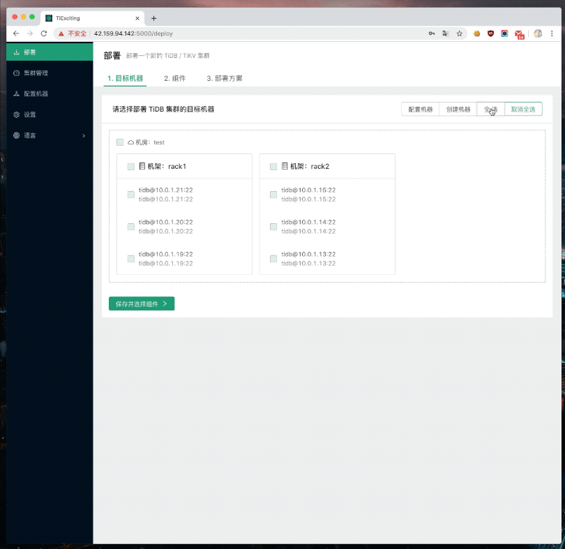
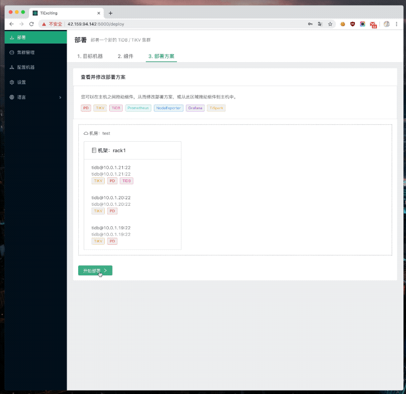
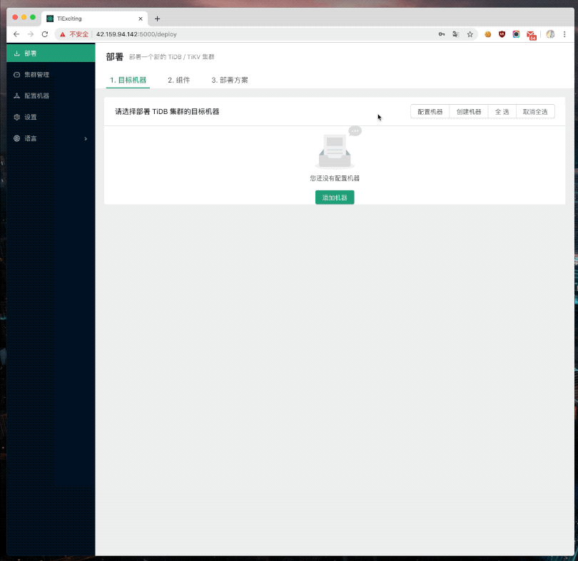
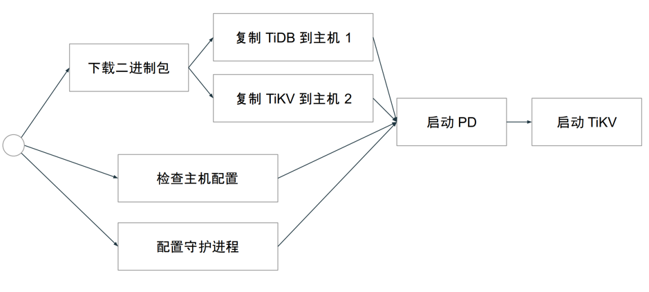

运维难，难于上青天。

作为 PingCAP 员工，我们不仅平时自己用着 TiDB，也会自发的想让周围人也用上 TiDB。但在这个过程中，我们发现有以下问题：

*   上船难：官方推荐的部署方法 TiDB Ansible 限制较多，有一定的学习成本。对于运维同学比较容易上手，但是对于研发同学就比较不友好。用户手册详细但是复杂，其中也有各种各样的限制，特别是遇到错误的时候不好处理。

*   开船难：用上 TiDB 之后，后续对 TiDB 集群进行运维（如扩容，升级），尤其在 PD 的扩容和缩容，安全性高，但是操作还是有些复杂。

*   开发上船容易翻：经常见到开发人员不知道水有多深，跟着文档在自己机器上尝试用 TiDB Ansible 部署 TiDB，结果一不小心就把系统改得面目全非。

为了改进和解决这些痛点，我们组队参加了 [TiDB Hackathon 2019](https://mp.weixin.qq.com/s/3-ww6MJnygvq8mpkDuwAig) 比赛，编写了 TiExciting 项目，并最终获得大家的认可拿到了三等奖。

## 当前的上船门槛有多高？

在参赛前，我们先评估了一下之前的体感问题是不是真实存在的问题，因此我们在本次 Hackathon Ucloud 新集群上进行了一番实测：

- 队友 A：腾讯微信研发，从未接触过 TiDB，首次尝试部署：

    - 按照 TiDB Ansible 超长的部署教程，部署 3 小时后没有成功，遂放弃。

- 队友 B：PingCAP 华东地区高级客户支持，为各种商业客户部署过 TiDB：

    - 操作熟练，但经常由于手滑或环境关系经历各种报错，凭丰富的知识知道怎么解决，最终使用 20 分钟部署完毕。

综上，实践表明，不论是新手还是老手，都要经过很复杂的步骤才能开始真正用起 TiDB 产品。另外，TiDB Ansible 本身还对部署环境提出了极高的要求，例如公有云环境直接无法通过入门检测，这些都会劝退大量新用户。

## 怎样可以快速上船和开船？

为了解决问题，我们先进行了需求设计：

- 为了能快速上船，部署过程本身应该要做到「快」，能并行的操作就并行进行。

- 直观方便清晰，最好不要文档就能用起来：提供图形化界面。

- 所有与易用性冲突的特性都需要让步。

    - TiDB Ansible 强制环境检查 → TiExciting 不阻止部署（但给出 Warning）。

    - TiDB Ansible 要求从中控机部署 → TiExciting 甚至可以从 Windows 开始部署，且不要求配置互信。

- 绿色环保有节操，没有全家桶。

    - TiDB Ansible 强制要求进行系统配置调优满足 TiDB 要求 → TiExciting 允许用户可选地配置系统以便更好地运行 TiDB，且用户知悉各个要进行的改动。

    - TiExciting 允许用户自行勾选想要安装的组件，遵循最小化原则。

当前安装都是安装一路绿灯，环境检查只做告警，不推荐在生产环境使用。后期我们会添加严格模式，来做生产集群管理。**时刻对生成环境抱有敬畏之心。**

## Hackathon 成果

### 部署

创建完目标机器（后文介绍机器添加方式）后，就可以**自由选择其中的机器进行部署**。界面上可以**自行勾选想要的组件**，或取消勾选不想要的组件。比如不想要监控大礼包，就可以直接取消勾选「监控」。另外 TiDB 也是可以取消勾选的，适用于只想使用 TiKV 的情况。

 图 1 部署方案

选择完组件后，**界面会自动根据节点数量、想要的组件生成部署方案**。当然，作为 Hackathon 作品，这里的自动方案不一定是最合理的，以及实际场景中用户很可能想要进一步自行定制拓扑，**因此用户可以在这个界面上拖拽各个组件来重新决定拓扑**，或添加新组件。一般来说，如果只是不严格想体验一下分布式 TiDB 的话，包括只有一个节点等情况，用户直接采用默认的拓扑即可，非常友好。

然后演示下最后安装的效果：

 图 2 安装演示

### 管理机器

启动 TiExciting 后，界面会引导用户首先增加机器，包括填写连接方式等。这里可以指定密码或密钥登录，无需 root，也无需创建特别的用户，只需填写运维人员平时连接上去的方式即可。增加机器时候的设置也可以从现有机器设置复制。

 图 3 服务器添加演示

高级配置中可选地可以指定位置标签，包括这个机器属于什么机架，及这个机器属于什么机房。如果有指定位置标签，配置完毕后就会在界面上按照机房和机架组织显示这些机器，非常直观。

 图 4 高级配置

完整成果演示视频可以点击这里：[TiExciting Demo 视频](https://drive.google.com/open?id=1v62lqGhOXNxTCMr7RKuKxuAfBCWZT4SF)

## 技术实现

### 界面

为了能跨各个平台展示界面，TiExciting 是以 Web 形式提供界面的，使用了比较流行的 React + MobX 方案实现。这样，不仅 TiExciting 的界面是跨平台的，而且即使 TiExciting 运行在无 UI 的服务器上，也能在用户浏览器上远程访问到界面。

### 跨平台

TiExciting 的部署逻辑及响应用户操作的逻辑是采用 Python 编写的，来达成跨平台的目的。我们设想采用 Python 打包工具来实现用户一键下载打开运行、不需要安装的理念，但实际 Hackathon 上用下来发现它只能是个设想，坑还是挺多的。另外 Python 本身 runtime 就很大。如果再给我们一次机会，大概会改用 Golang 吧，生成一个 binary 是真的很简单。

### 快

为了尽可能地快，TiExciting 会尽可能地基于文件哈希来复用文件，例如已下载且校验通过的 TiDB 二进制大礼包就不需要重复下载，已经成功部署的同理。TiExciting 还实现了异步有向无环图的任务调度机制，当所有先决任务完成后，后续任务就可以得到执行，且之间没有依赖关系的任务可以并行执行，如下图所示：

 图 5 异步有向无环图的任务调度机制

## 聊聊未来

因为 Hackathon 时间有限，其实还有很多没来得及做但想做的功能：

- 更好的部署方案规划。

- 纯界面实现扩容、缩容。

- 纯界面实现更新集群。

- 纯界面管理集群（启动、停止、更新、滚动等）。

- 将现有 TiDB Ansible 集群纳入 TiExciting 管理。

虽然 Hackathon 已告一段落，但我们希望将来能进一步完善 TiExciting，将它想做的都落地下来，成为一个大家喜欢用的通用的工具，帮助更多人用上 TiDB 并改善运维的复杂度。

