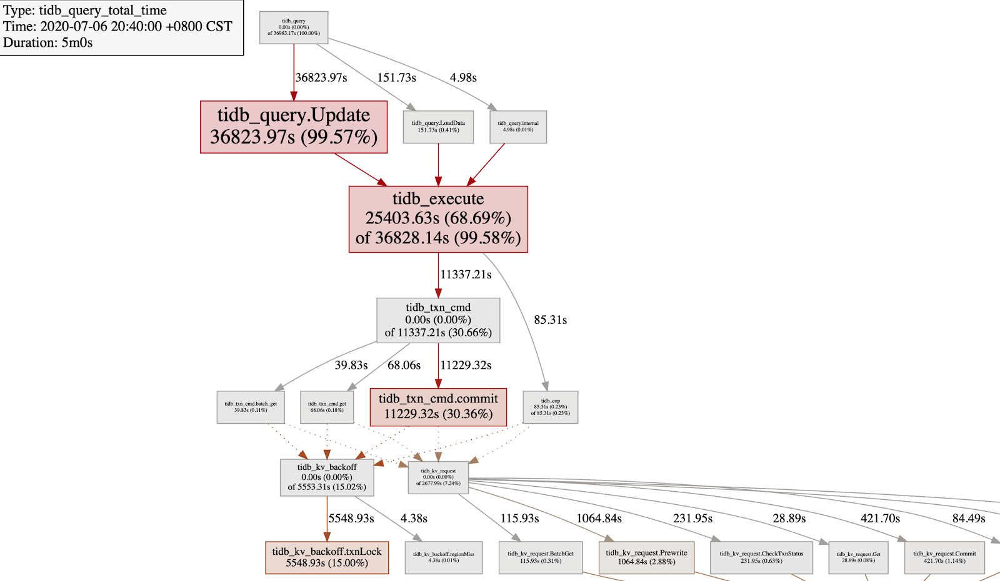
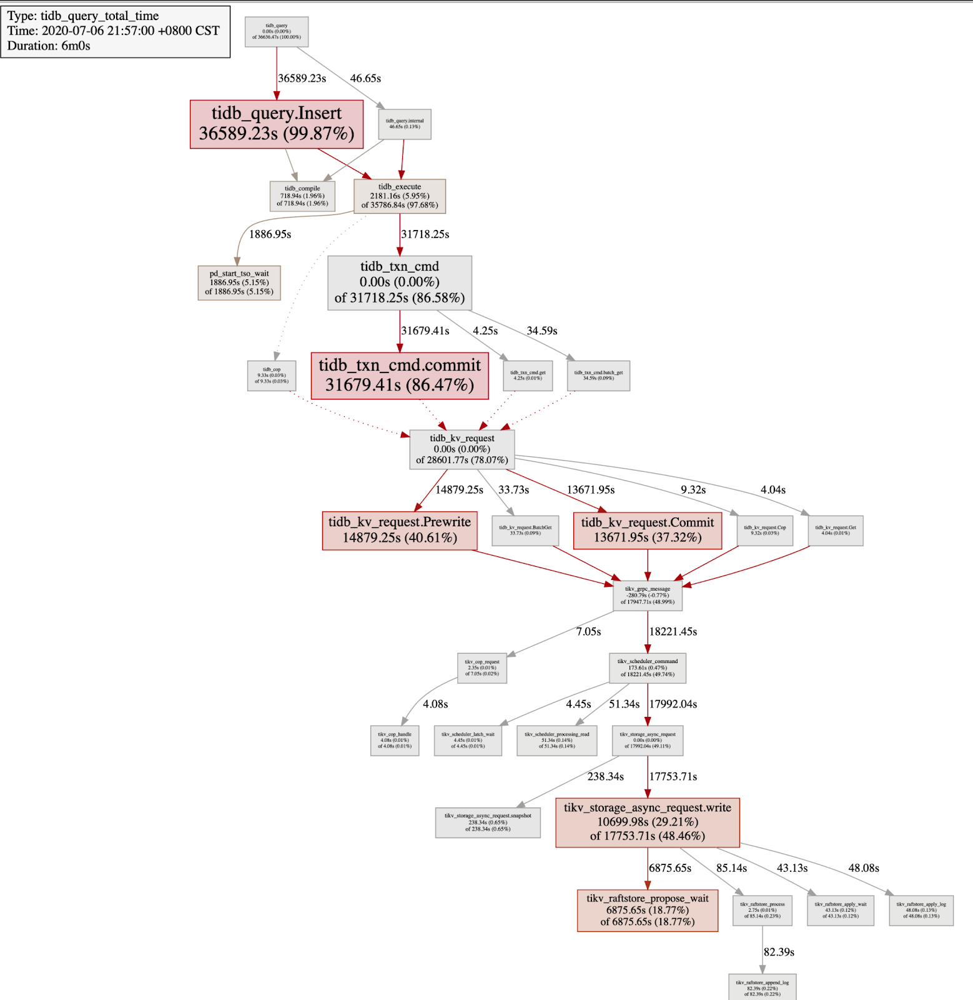
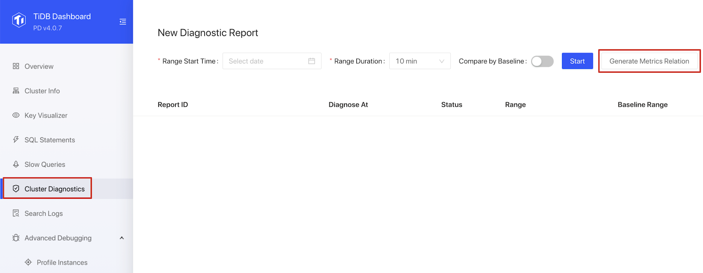

TiDB 使用 Prometheus 和 Grafana 提供了非常详细的监控指标。在遇到各种性能或稳定性问题时，这些监控一般是问题的关键线索。但详尽的细节监控指标使用门槛较高，刚入门的 TiDB DBA 可能难以上手，例如：

*   如何快速了解当前集群最耗时的是哪类操作？

*   发现写入耗时很长，如何进一步定位原因，应该查看哪些监控项？

*   监控项这么多，它们之间的关系是什么？

TiDB 4.0.7 起提供了一个新功能，可以将数据库各个内部流程的耗时监控按父子关系绘制为关系图，帮助用户快速以另一种维度了解集群状态。

## 简介

监控关系图是在指定的时间范围内，将各个监控项按父子关系绘制的关系图。图中每个方框节点代表一个监控项，包含了以下信息：

*   监控项的名称

*   监控项的总耗时

*   监控项总耗时和查询总耗时的比例

父节点监控的总耗时 = 自己的耗时 + 孩子节点的耗时，所以有些节点还会显示自己的耗时和总耗时的比例。

例如下面监控节点表示：tidb_execute 监控项的总耗时为 19306.46 秒，占总查询耗时的 89.4%，其中本身的耗时是 9070.18 秒，占总查询耗时的 42%。将鼠标悬停在该方框上，可以看到监控项的注释说明，总次数，平均耗时，平均 P99 耗时等更多该监控的信息。

每个节点的大小和颜色深浅，与监控项自己的耗时占总查询耗时的比例成正比。一般在这个图中可以重点关注耗时较多的监控节点，然后顺着父子关系向下梳理。详细介绍请参考[官方文档](https://docs.pingcap.com/zh/tidb/dev/dashboard-metrics-relation)。话不多说，来看两个简单的示例吧。

### 示例 1

最近新上线一个业务后，原来的集群响应突然变慢了很多，小明看服务器 CPU 都挺空闲的呀，然后抓了一个监控关系图如下：

可以很快发现，上图中：

1.  tidb_query.Update 表示 update 语句的执行耗时占总查询耗时的 99.59%。

2.  tidb_execute 表示 TiDB 的执行引擎本身耗时占 68.69%

3.  tidb_txn_cmd.commit 表示事务提交的耗时占总耗时的 30.66%

4.  tidb_kv_backoff.txnLock 表示事务遇到锁冲突的 backoff 总耗时占 15%，这要比发送 prewrite 和 commit 的 tidb_kv_request 的耗时高很多。

到此，可以确定 update 语句存在严重的写冲突，可以按照 [乐观事务模型下写写冲突问题排查](https://docs.pingcap.com/zh/tidb/stable/troubleshoot-write-conflicts) 进一步排查冲突的表和 SQL 语句，然后和业务方沟通从业务上避免写冲突。

### 示例 2

最近需要导入一批数据到 TiDB 集群，导入速度有点慢，小明想看看系统现在慢在哪儿，然后看能不能优化下，他抓了一个导入数据时的监控耗时关系图如下：

上图中，最下面可以看到 tikv 的 raftstore 在处理 propose 前的等待耗时很长，说明 raftstore 存在瓶颈了，然后可以进一步查看 raftstore cpu，append/apply log 的延迟，如果 raftstore 的 thread cpu 使用率不高，则大概率是磁盘是磁盘的问题。具体可以按照 [Performance TiKV Map](https://asktug.com/_/tidb-performance-map/#/tikv) 中 raftstore 相关模块和 [TiDB 磁盘 I/O 过高的处理办法](https://docs.pingcap.com/zh/tidb/stable/troubleshoot-high-disk-io) 进行排查，

除此之外，可以排查是否存在热点，可以按照 [TiDB 热点问题处理](https://docs.pingcap.com/zh/tidb/stable/troubleshoot-hot-spot-issues) 进一步排查是否有热点。

## 使用介绍

>注：生成监控关系图时，会从 prometheus 中读取各项监控的数据。所以 TiDB 集群需要部署 prometheus ，推荐使用 tiup 部署集群。

登录 Dashboard 后点击左侧导航的集群诊断可以进入此功能页面：

设置*区间起始时间*和*区间长度*参数后，点击*生成监控关系图*按钮后，会进入监控关系图页面。

## 最后

本文介绍的监控关系图旨在帮助用户快速了解 TiDB 集群的负载情况和众多监控项之间的关系，后续计划集成 [TiDB Performance Map](https://asktug.com/_/tidb-performance-map/#/)，把和该项监控项相关的其他监控以及配置也关联上，进一步完善 TiDB 集群中各个组件监控项之间的关系。 

如有任何疑问或者建议，欢迎在 [AskTUG](https://asktug.com/t/topic/63296) 下给我们留言~