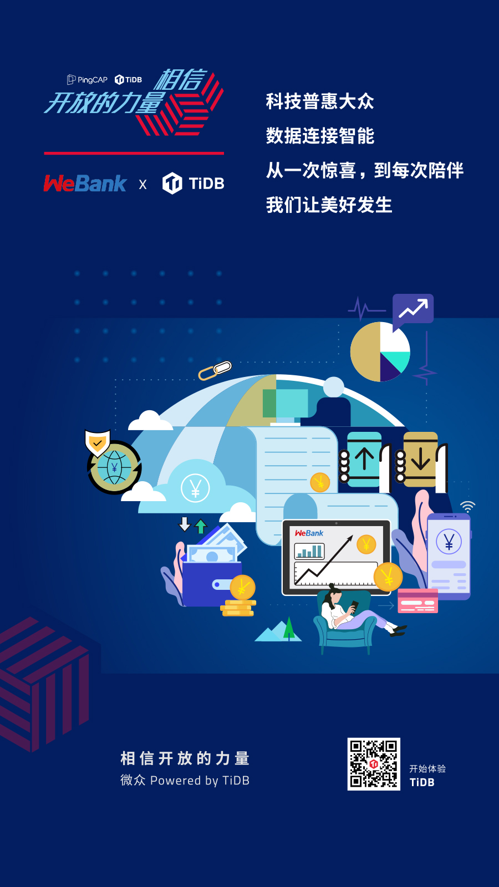
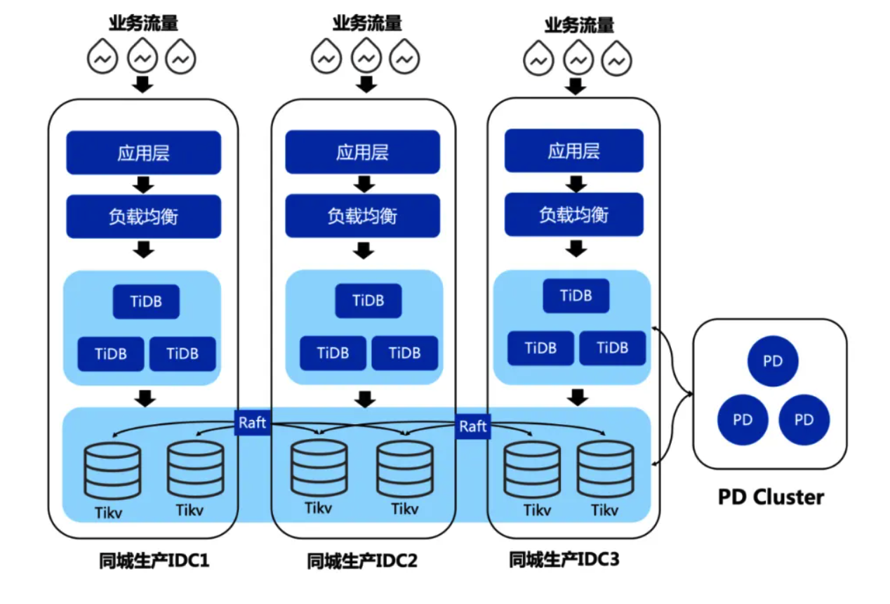

**「我们已经用起来了」**，是我们最喜欢听到的话，简简单单几个字的背后代表着沉甸甸的信任和托付。从今天开始，我们将通过**「相信开放的力量」**系列深度案例分享，从业务的角度，看看一个数据库为各行业用户带来的业务价值。 **本篇文章将介绍 TiDB 助力微众银行金融核心场景的故事。**

>科技普惠大众，数据连接智能

>从一次惊喜，到每次陪伴

>我们让美好发生

微众银行是国内首家开业的民营银行，由腾讯、百业源和立业等多家知名企业发起设立，于 2014 年 12 月获得由深圳银监局颁发的金融许可证，总部位于深圳。开业 5 年多来，微众银行始终坚持普惠金融的定位不变，积极运用金融科技构建普惠金融新业态、新模式，初步走出了一条商业可持续的普惠金融发展模式。

截至目前，微众银行服务个人客户已突破 2.5 亿人；个人经营户超过 2000 万，企业法人客户超过 150 万家，累计发放了超过 3200 亿元的贷款，支持就业人口超过 400 万。这些客户全部为民营企业，分布在 27 个省的 200 余座城市，其中，约三分之二的企业客户和 37% 的个人经营贷款客户属首次获得银行贷款，充分体现了微众银行普惠金融的定位和特色。

## 客户收益

微众银行成立以来始终以科技作为驱动业务发展的核心引擎，已经具备完全自主可控、支持亿级海量用户和高并发交易的核心系统，**已实现年均日交易超过 3 亿笔、单日交易峰值超过 6 亿笔；每账户运维成本不到行业平均的十分之一。**

从 2018 年开始调研并上线 TiDB 至今，微众银行已经有数十个业务系统在 TiDB 上投产，数据量从百 G 到几十 T 不等，目前也有多个重要的系统正在 POC 或准备投产阶段。今天这篇文章介绍两个 TiDB 支撑的比较重要的场景：

- 资产证券化系统批量场景下的 TiDB 实践。

- 交易数据存证 TiDB 实践。

## 面临挑战

自成立之初，微众银行就非常有前瞻性的意识到底层基础设施建设对银行发展的重要性，选择了建设分布式架构 IT 基础设施的道路。基于廉价通用的硬件设备和各类开源的软件产品，微众建立了基于单元化的松耦合、可扩展的分布式架构。

为了实现业务规模的水平扩展，微众银行设计了基于 DCN 的分布式可扩展核心架构，从而即实现了整体扩展性，也保证了单 DCN 数据库层面架构的简洁性。DCN，即 Data Center Node(数据中心节点)，是一个“自包含单位”，包括了完整的应用层，接入层和数据库，每个 DCN 承载规定数据量的用户。可以通俗的理解为，一个DCN，即为一个微众银行的线上的虚拟分行，这个虚拟分行只承载微众银行某个业务的一部分客户。

基于 DCN 可以实现集群规模的水平扩展，这种架构对于数据库来说，是比较友好的，每个 DCN 的用户规模是确定的，因此对数据库的容量和性能要求也是可确定的。不必再采用复杂的中间件分库分表的方式构建数据库，而只用单实例模式承载，极大简化了数据库架构，也降低了业务开发成本。

**但同时也遇到一些瓶颈。因为一个 DCN 内部采用的是单实例的部署模式，对于有些无法通过 DCN 拆分进行扩展的业务场景，或者需要进行数据汇总类的业务场景，单实例的性能和容量就很容易到达瓶颈。**

## 为何选择 TiDB

为了解决上面提到的瓶颈，经过详细的调研和评测，比对了国内外多款 NewSQL 数据库产品，最终确定以国产开源 NewSQL 数据库产品 TiDB 作为切入点。2018 年，TiDB 作为一款新兴的开源 NewSQL 数据库产品，吸引了微众银行，并最终选择：

### 架构理念先进

TiDB 的架构理念较为先进，原生分布式的架构能够很好解决水平扩展同时保持数据强一致的问题，同时兼容 MySQL 协议并能无缝的作为从库对上游 MySQL 进行实时同步，也让业务的迁移成本降到最低。

### 开源的运营方式

TiDB 以开源方式运营，并且建立了非常活跃的开源社区以及众多的用户。开源的运营模式，版本迭代快速有效，与微众拥抱开源的理念相契合。此后，在开源社区运营领域也和微众有着较好的合作，为微众提供了不少开源社区的运营经验。

### 专业的售后服务

TiDB 的专业售后支持团队 PTC（PingCAP Tech Center）的优质服务 ，在数据库领域和开源社区领域都有着深厚的技术基础和经验积累。针对客户的技术支持也非常快速到位。对于任何一个重要业务的接入，从评估、测试到灰度上线，都会积极参与，并给出建设的方案和意见。

## 微众银行 TiDB 业务实践

### 资产证券化系统批量场景下的 TiDB 实践

资产证券化系统，目前每天要从上游系统同步数千万级别的基础数据来支持业务展开，并且预计后续将接入更多的产品数据，这样不仅面临时效性要求的压力，DB 容量也将会成为瓶颈；此外由于系统依赖上游系统的表结构，经常需要跟随上游系统做 DDL 变更，PT-OSC 方案限制较多。

**存在的问题：**

- **单机 MySQL 数据库不支持容量水平扩展**，随着业务的规模增大，DB 容量瓶颈问题将会日益凸显；

- **单机 MySQL 数据库不支持性能水平扩展**，无法通过扩容资源来线性提升批量效率；

- 单机 MySQL 数据库对基础数据全表清库、数据高并发插入等场景，由于并发线程过高易引起主备延迟等问题做了限流，这将会降低批量的整体时效；

- 单机 MySQL 数据库的在线 DDL 特性存在锁表，**易引起主备延迟、IO 突增等问题**而PT-OSC 方案同样限制较多；

无疑 TiDB 是可以比较方便地处理这些问题，并且未来随着 TiFlash 上线后，还可进一步的运用在离线报表统计逻辑上，缩减处理时长。

**“借助 TiDB 的水平扩展性，整个批量耗时降低了 58% 左右。”** 微众银行数据平台室经理胡盼盼表示，未来微众银行将会结合自身的业务需求，以及 TiDB 的新特性，探索更多的业务场景。

### 数据存证系统 TiDB 迁移实践

数据存证系统是微众银行非常重要的系统，存储了具有法律效力的证据类数据，这些数据对客户来说是非常重要的。

随着越来越多的业务系统的接入，该场景的数据增长速度非常快，比如每一次转账都需要生成一个证据，并且不是简单的一条记录，而是发生纠纷时法院认可的证据，所以也决定了这些数据不能删除，这意味着这些海量的数据一定需要一个分布式数据库方案承载。另外由于这些业务数据属于无法按照 DCN 拆分的全局数据，没办法很好的横向扩展，于是在数据库层面遇到了很大的瓶颈。

微众 TiDB 部署架构图

如上图所示，基于这些场景特点，微众同样选择了 TiDB 的解决方案。有几个基本的迁移原则：

- 数据不能错、不能丢；

- 服务敏感度非常高，需要尽量无缝切换到 TiDB 架构上；

- 因为是比较严肃的金融场景，如果在迁移过程中有任何困难，期望能够随时回切到 MySQL。  

迁移整体方案步骤流程比较长，但会更加安全。经过一系列迁移操作与观察后，各方面的性能指标都非常稳定，因此微众银行决定将反向同步 MySQL 断掉，也就意味着数据存证系统这样一个非常重要的系统，完全跑在了 TiDB 上。

**“回顾整个迁移过程，也是比较流畅且顺利的。”微众银行数据平台室经理胡盼盼表示。**

## 与客户同行，相信开放的力量

每次数据库架构改善与落地，无论是 TB 级还是 PB 级，都需要付出努力，但这也值得每一个企业去做。在当下这个时代，不管企业的规模如何，都要学会借助开源的力量，避免去重复的造轮子。

每一个看似轻松的背后都有不为人知的努力，每一个看似光鲜亮丽的背后，都有不为人知的付出。分布式数据库建设之路道阻且长，TiDB 愿与微众银行及每个客户一起，携手并肩把事情做好。