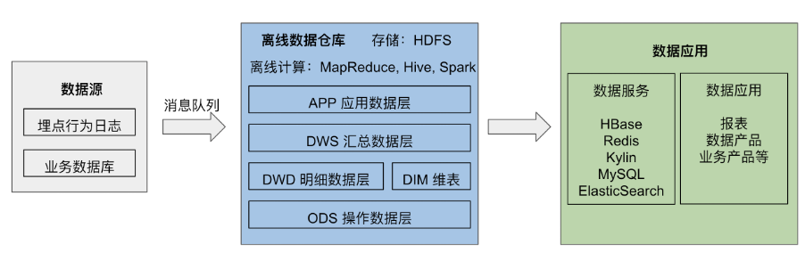
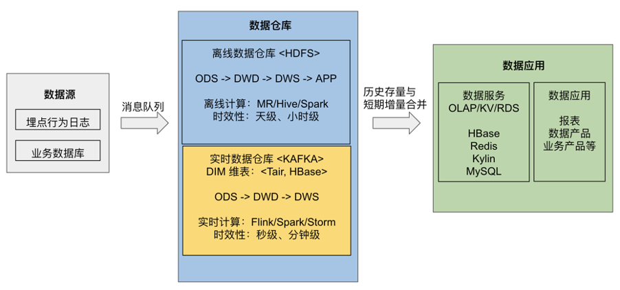
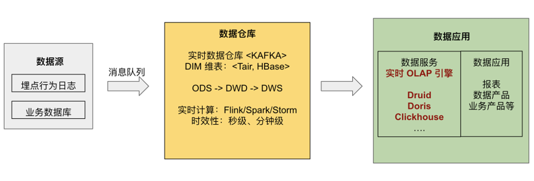
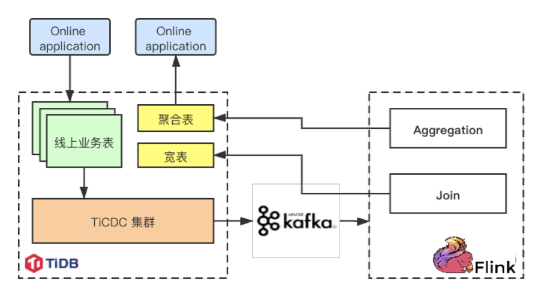
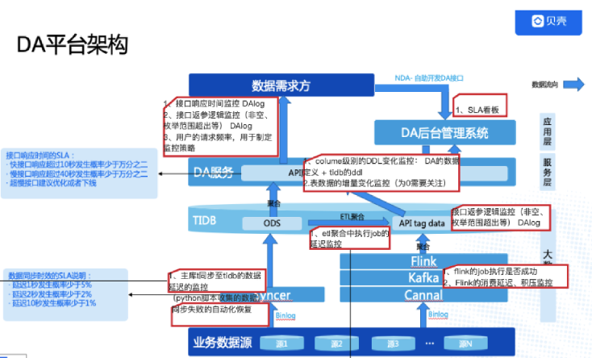
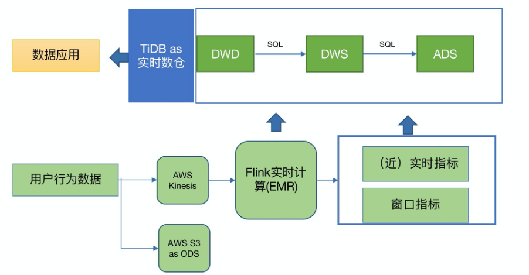
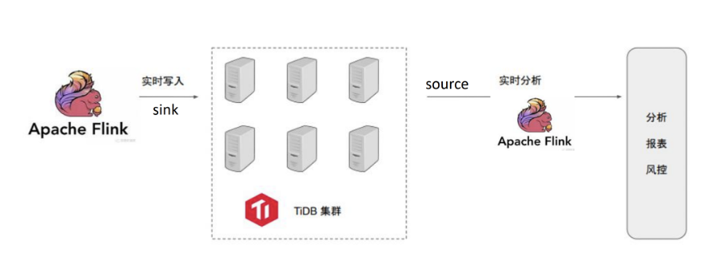

>作者介绍：齐智

随着互联网飞速发展，企业业务种类会越来越多，业务数据量会越来越大，当发展到一定规模时，传统的数据存储结构逐渐无法满足企业需求，实时数据仓库就变成了一个必要的基础服务。以维表 Join 为例，数据在业务数据源中以范式表的形式存储，在分析时需要做大量的 Join 操作，降低性能。如果在数据清洗导入过程中就能流式的完成 Join，那么分析时就无需再次 Join，从而提升查询性能。

利用实时数仓，企业可以实现实时 OLAP 分析、实时数据看板、实时业务监控、实时数据接口服务等用途。但想到实时数仓，很多人的第一印象就是架构复杂，难以操作与维护。而得益于新版 Flink 对 SQL 的支持，以及 TiDB HTAP 的特性，我们探索了一个高效、易用的 Flink+TiDB 实时数仓解决方案。

本文将首先介绍实时数仓的概念，然后介绍 Flink+TiDB 实时数仓的架构与优势，接着给出一些已经在使用中的用户场景，最后给出在 docker-compose 环境下的 Demo，用于读者进行尝试。

## 实时数仓的概念

数据仓库的概念在 90 年代由 Bill Inmon 提出，是指一个面向主题的、集成的、相对稳定的、反映历史变化的集合，用于支持管理决策。当时的数据仓库通过消息队列收集来自数据源的数据，通过每天或每周进行一次计算以供报表使用，也称为离线数仓。

离线数仓架构

进入 21 世纪，随着计算技术的发展、以及整体算力的提升，决策的主体逐渐从人工控制转变为计算机算法，出现了实时推荐、实时监控分析等需求，对应的决策周期时间由天级逐步变为秒级，在这些场景下，实时数仓应运而生。

当前的实时数仓主要有三种架构：Lambda 架构、Kappa 架构以及实时 OLAP 变体架构：

1. Lambda 架构是指在离线数仓的基础上叠加了实时数仓部分，使用流式引擎处理实时性较高的数据，最后将离线和在线的结果统一供应用使用。

  
  
  
实时数仓的 Lambda 架构

2. Kappa 架构则移除了离线数仓部分，全部使用实时数据生产。这种架构统一了计算引擎，降低了开发成本。

  
  
  
实时数仓的 Kappa 架构

3. 随着实时 OLAP 技术的提升，一个新的实时架构被提出，暂时被称为“实时 OLAP 变体”。简单来说，就是将一部分计算压力从流式计算引擎转嫁到实时 OLAP 分析引擎上，以此进行更加灵活的实时数仓计算。

  
  
  
实时数仓的 OLAP 架构

总结一下，对于实时数仓，Lambda 架构需要维护流和批两套引擎，开发成本相较其它两者更高。相比于 Kappa 架构，实时 OLAP 变体架构可以执行更加灵活的计算，但需要依赖额外的实时 OLAP 算力资源。接下来我们将介绍的 Flink + TiDB 实时数仓方案，就属于实时 OLAP 变体架构。

关于实时数仓及这些架构更加详细的对比说明，有兴趣的读者可以参考 Flink 中文社区的[这篇文章](https://mp.weixin.qq.com/s/l--W_GUOGXOWhGdwYqsh9A)。

## Flink + TiDB 实时数仓

Flink 是一个低延迟、高吞吐、流批统一的大数据计算引擎，被普遍用于高实时性场景下的实时计算，具有支持 exactly-once 等重要特性。

在集成了 TiFlash 之后，TiDB 已经成为了真正的 HTAP（在线事务处理 OLTP + 在线分析处理 OLAP）数据库。换句话说，在实时数仓架构中，TiDB 既可以作为数据源的业务数据库，进行业务查询的处理；又可以作为实时 OLAP 引擎，进行分析型场景的计算。

结合了 Flink 与 TiDB 两者的特性，Flink + TiDB 的方案的优势也体现了出来：首先是速度有保障，两者都可以通过水平扩展节点来增加算力；其次，学习和配置成本相对较低，因为 TiDB 兼容 MySQL 5.7 协议，而最新版本的 Flink 也可以完全通过 Flink SQL 和强大的连接器（connector）来编写提交任务，节省了用户的学习成本。

对于 Flink + TiDB 实时数仓，下面是几种常用的搭建原型，可以用来满足不同的需求，也可以在实际使用中自行扩展。

### 以 MySQL 作为数据源

通过使用 Ververica 官方提供的 [flink-connector-mysql-cdc](https://github.com/ververica/flink-cdc-connectors)，Flink 可以既作为采集层采集 MySQL 的 binlog 生成动态表，也作为流计算层实现流式计算，如流式 Join、预聚合等。最后，Flink 通过 JDBC 连接器将计算完成的数据写入 TiDB 中。

以 MySQL 作为数据源的简便架构

这个架构的优点是非常简洁方便，在 MySQL 和 TiDB 都准备好对应数据库和表的情况下，可以通过只编写 Flink SQL 来完成任务的注册与提交。读者可以在本文末尾的【在 docker-compose 中进行尝试】一节中尝试此架构。

### 以 Kafka 对接 Flink

如果数据已经从其它途径存放到了 Kafka 中，可以方便地通过 [Flink Kafka Connector](https://ci.apache.org/projects/flink/flink-docs-release-1.11/zh/dev/table/connectors/kafka.html) 使 Flink 从 Kafka 中获得数据。

在这里需要提一下的是，如果想要将 MySQL 或其它数据源的变更日志存放在 Kafka 中后续供 Flink 处理，那么推荐使用 Canal 或 Debezium 采集数据源变更日志，因为 Flink 1.11 原生支持解析这两种工具格式的 changelog，无需再额外实现解析器。

以 MySQL 作为数据源，经过 Kafka 的架构示例

### 以 TiDB 作为数据源

[TiCDC](https://docs.pingcap.com/zh/tidb/stable/ticdc-overview) 是一款通过拉取 TiKV 变更日志实现的 TiDB 增量数据同步工具，可以利用其将 TiDB 的变更数据输出到消息队列中，再由 Flink 提取。

以 TiDB 作为数据源，通过 TiCDC 将 TiDB 的增量变化输出到 Flink 中

在 4.0.7 版本，可以通过 [TiCDC Open Protocol](https://docs.pingcap.com/zh/tidb/stable/ticdc-open-protocol) 来完成与 Flink 的对接。在之后的版本，TiCDC 将支持直接输出为 canal-json 形式，以供 Flink 使用。

## 案例与实践

上个部分介绍了一些基础的架构，实践中的探索往往更加复杂和有趣，这一部分将介绍一些具有代表性和启发性的用户案例。

### 小红书

小红书是年轻人的生活方式平台，用户可以通过短视频、图文等形式记录生活点滴，分享生活方式，并基于兴趣形成互动。截至到 2019 年 10 月，小红书月活跃用户数已经过亿，并持续快速增长。

在小红书的业务架构中，Flink 的数据来源和数据汇总处都是 TiDB，以达到类似于“物化视图”的效果：

1. 左上角的线上业务表执行正常的 OLTP 任务。

2. 下方的 TiCDC 集群抽取 TiDB 的实时变更数据，以 changelog 形式传递到 Kafka 中。

3. Flink 读取 Kafka 中的 changelog，进行计算，如拼好宽表或聚合表。

4. Flink 将结果写回到 TiDB 的宽表中，用于后续分析使用。

小红书 Flink TiDB 集群架构

整个过程形成了 TiDB 的闭环，将后续分析任务的 Join 工作转移到了 Flink 上，并通过流式计算来缓解压力。目前这套方案已经支持起了小红书的内容审核、笔记标签推荐、增长审计等业务，经历了大吞吐量的线上业务考验且持续运行稳定。

### 贝壳金服

贝壳金服持续多年深耕居住场景，积累了丰富的中国房产大数据。贝壳金服以金融科技为驱动，利用AI算法高效应用多维海量数据以提升产品体验，为用户提供丰富、定制化的金融服务。

在贝壳数据组的数据服务中，Flink 实时计算用于典型的维表 Join：

1. 首先，使用 Syncer （MySQL 到 TiDB 的一个轻量级同步工具）采集业务数据源上的维表数据同步到 TiDB 中。

2. 然后，业务数据源上的流表数据则通过 Canal 采集 binlog 存入 kafka 消息队列中。

3. Flink 读取 Kafka 中流表的变更日志，尝试进行流式 Join，每当需要维表中的数据时，就去 TiDB 中查找。

4. 最后，Flink 将拼合而成的宽表写入到 TiDB 中，用于数据分析服务。

贝壳金服数据分析平台架构

利用以上的结构，可以将数据服务中的主表进行实时 Join 落地，然后服务方只需要查询单表。这套系统在贝壳金服已经深入各个核心业务系统，跨系统的数据获取统一走数据组的数据服务，省去了业务系统开发 API 和内存聚合数据代码的开发工作。

### 智慧芽

PatSnap（智慧芽）是一款全球专利检索数据库，整合了 1790 年至今的全球 116 个国家地区 1.3 亿专利数据和 1.7 亿化学结构数据。可检索、浏览、翻译专利，生成 Insights 专利分析报告，用于专利价值分析、引用分析、法律搜索，查看 3D 专利地图。

智慧芽使用 Flink + TiDB 替换了原有的 Segment + Redshift 架构。

原有的 Segment + Redshift 架构，仅构建出了 ODS 层，数据写入的规则和 schema 不受控制。且需要针对 ODS 编写复杂的 ETL 来按照业务需求进行各类指标的计算来完成上层需求。Redshift 中落库数据量大，计算慢（T+1时效），并影响对外服务性能。

替换为基于 Kinesis + Flink + TiDB 构建的实时数仓架构后，不再需要构建 ODS 层。Flink 作为前置计算单元，直接从业务出发构建出 Flink Job ETL，完全控制了落库规则并自定义 schema； 即仅把业务关注的指标进行清洗并写入 TiDB 来进行后续的分析查询，写入数据量大大减少。按用户/租户、地区、业务动作等关注的指标，结合分钟、小时、天等不同粒度的时间窗口等，在 TiDB 上构建出 DWD/DWS/ADS 层，直接服务业务上的统计、清单等需求，上层应用可直接使用构建好的数据，且获得了秒级的实时能力。

智慧芽数据分析平台架构

用户体验：在使用了新架构后，入库数据量、入库规则和计算复杂度都大大下降，数据在 Flink Job 中已经按照业务需求处理完成并写入 TiDB，不再需要基于 Redshift 的 全量 ODS 层进行 T+1 ETL。基于TiDB构建的实时数仓，通过合理的数据分层，架构上获得了极大的精简，开发维护也变得更加简单；在数据查询、更新、写入性能上都获得大幅度提升；在满足不同的 adhoc 分析需求时，不再需要等待类似 Redshift 预编译的过程；扩容方便简单易于开发。
目前这套架构正在上线，在智慧芽内部用来进行用户行为分析和追踪，并汇总出公司运营大盘、用户行为分析、租户行为分析等功能。

### 网易互娱

网易 2001 年正式成立在线游戏事业部，经过近20年的发展，已跻身全球七大游戏公司之一。在 App Annie 发布的“2020 年度全球发行商 52 强”榜单中，网易位列第二。

网易互娱数据计费组平台架构

在网易互娱计费组的应用架构中，一方面使用 Flink 完成业务数据源到 TiDB 的实时写入；另一方面，以 TiDB 作为分析数据源，在后续的 Flink 集群中进行实时流计算，生成分析报表。此外，网易互娱现在内部开发了 flink 作业管理平台，用于管理作业的整个生命周期。

### 知乎

知乎是中文互联网综合性内容平台，以“让每个人高效获得可信赖的解答”为品牌使命和北极星。截至 2019 年 1 月，知乎已拥有超过 2.2 亿用户，共产出 1.3 亿个回答。

知乎作为 PingCAP 的合作伙伴，同时也是 Flink 的深度用户，在自己的实践过程中开发了一套 TiDB 与 Flink 交互工具并贡献给了开源社区：[pingcap-incubator/TiBigData](https://github.com/pingcap-incubator/TiBigData)，主要包括了如下功能：

1. TiDB 作为 Flink Source Connector，用于批式同步数据。

2. TiDB 作为 Flink Sink Connector，基于 JDBC 实现。

3. Flink TiDB Catalog，可以在 Flink SQL 中直接使用 TiDB 的表，无需再次创建。

## 在 docker-compose 中进行尝试

为了方便读者更好的理解，我们在 [https://github.com/LittleFall/flink-tidb-rdw](https://github.com/LittleFall/flink-tidb-rdw) 中提供了一个基于 docker-compose 的 MySQL-Flink-TiDB 测试环境，供大家测试使用。

[Flink TiDB 实时数仓 Slides](https://docs.google.com/presentation/d/1H3D_D6MKS3vT2-WMhpclG3xzIMA1_jR_fqwJ3KSzxrw/edit#slide=id.g446c4deb4d_0_341) 中提供了该场景下一个简单的教程，包括概念解释、代码示例、简单原理以及一些注意事项，其中示例包括：

1. Flink SQL 简单尝试

2. 利用 Flink 进行从 MySQL 到 TiDB 的数据导入

3. 双流 Join

4. 维表 Join

在启动 docker-compose 后，可以通过 Flink SQL Client 来编写并提交 Flink 任务，并通过 localhost:8081 来观察任务执行情况。

如果大家对 Flink+TiDB 实时数仓方案有兴趣、疑惑，或者在探索实践过程中积累了想要分享的经验，欢迎到 TiDB 社区（如 [AskTUG](https://asktug.com)）、Flink 社区（如 [Flink 中文邮件](http://apache-flink.147419.n8.nabble.com)）或通过我的邮件（qizhi@pingcap.com）进行探讨。

## 参考阅读

1. [基于 Flink 的典型 ETL 场景实现方案](https://mp.weixin.qq.com/s/l--W_GUOGXOWhGdwYqsh9A)，Flink 中文社区关于实时数仓概念及流上 Join 的讨论。

2. [How We Use a Scale-Out HTAP Database for Real-Time Analytics and Complex Queries](https://en.pingcap.com/case-studies/how-we-use-a-scale-out-htap-database-for-real-time-analytics-and-complex-queries/)，小红书使用 TiDB 的实践分享文章。

3. [How We Build an HTAP Database That Simplifies Your Data Platform](https://dzone.com/articles/how-we-build-an-htap-database-that-simplifies-your)，TiDB 的 HTAP 架构以及在数据平台上的应用。

4. [TiDB: A Raft-based HTAP Database](http://www.vldb.org/pvldb/vol13/p3072-huang.pdf)，TiDB 原理论文。

5. [Flink SQL CDC 上线！我们总结了 13 条生产实践经验](https://zhuanlan.zhihu.com/p/243187428)，Flink 中文社区，关于 Flink SQL CDC 的运维生产经验。
